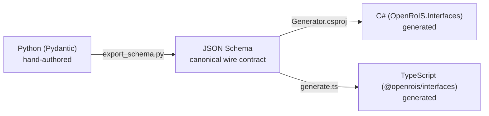

# Architectural Decisions

OpenRoIS is shaped by a set of deliberate architectural decisions. Each one is
designed to keep the core paradigm-neutral, the SDK simple, and the system
extensible without rewrites.

## Paradigm-neutral core

The engine, gateway, and client SDK never assume hardware, a world model, or any
specific middleware. A single `BusAdapter` abstraction decouples the core from ROS 2,
in-process runtimes, gRPC services, or any future paradigm. Adding a new paradigm is
an additive adapter, never a rewrite.

This decision is enforced structurally, not by convention. The engine has zero
references to ROS, DDS, gRPC, or any game engine. A grep for transport-specific
symbols in the engine source returns nothing. The same contract test suite runs
against every adapter, catching paradigm leakage.

## Spec-first, symbolic data only

Every interface traces back to the normative IDL in `normative/machine-readable/`.
Messages carry only symbolic data ("person detected, count: 2"), never raw sensor
buffers. This keeps the control plane lightweight and lets scenario logic use simple
conditional branching on structured results.

## Single source of truth for types

Types flow in one direction:

Python Pydantic models are the source of truth. JSON Schema is the canonical wire
format. C# and TypeScript types are **generated, never hand-written**, so all three
language stacks stay consistent. A schema-drift test in CI verifies that committed
schemas match Pydantic output. This eliminates an entire class of bugs: type
mismatches between the SDK and the gateway.

## Transport-appropriate, not transport-uniform

OpenRoIS does not invent a new wire protocol and does not force one transport
everywhere. Each boundary uses the transport that fits best: WebSocket for remote
control, ROS 2/DDS for the robot bus, in-process calls for avatars, gRPC for
distributed services, WebRTC for media. This respects the spec's separation of
message from transport while choosing concrete, proven technologies for each
boundary.

## Vertical slices over horizontal layers

Each milestone delivers a working end-to-end path, not an isolated layer. M0
through M5 culminate in a usable robot demo (the MVP). The in-process adapter is
built first because it is the simplest. This ordering is a guard against DDS
assumptions leaking into the core: if the simplest adapter works, and the engine
depends only on the `BusAdapter` contract, then adding DDS later cannot retroactively
introduce coupling.

## The SDK is the product

Adoption is driven by how easy it is to write a scenario. The SDK is identical
whether the host is a physical robot, a virtual avatar, or a distributed service.
The host paradigm is hidden behind the gateway. A researcher who writes a scenario
against the SDK does not need to know whether the target is a ROS 2 robot or a
Unity avatar. Only the gateway configuration changes.