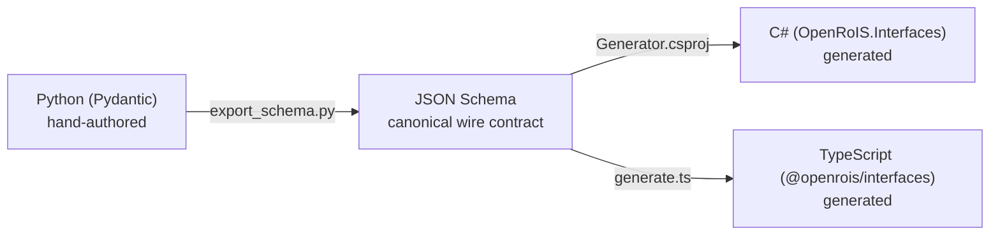

# Architectural Decisions

OpenRoIS is shaped by a set of deliberate architectural decisions. Each one is
designed to keep the core paradigm-neutral, the SDK simple, and the system
extensible without rewrites.

## 3.1 Paradigm-neutral core

The engine and client SDK never assume hardware, a world model, or any
specific middleware. A single `Component Contract` decouples the engine from ROS 2,
virtual avatars, AI services, or any future paradigm. Adding a new paradigm is
an additive sub-engine, never a rewrite.

This decision is enforced structurally, not by convention. The engine has zero
references to ROS, DDS, gRPC, or any game engine. The same contract test suite runs
against every sub-engine, catching paradigm leakage.

## 3.2 Spec-first, symbolic data only

Every interface traces back to the normative IDL in the OMG machine-readable files
at [https://www.omg.org/spec/RoIS/2.0/Beta2#docs-normative-machine](https://www.omg.org/spec/RoIS/2.0/Beta2#docs-normative-machine).
Messages carry only symbolic data ("person detected, count: 2"), never raw sensor
buffers. This keeps the control plane lightweight and lets scenario logic use simple
conditional branching on structured results.

## 3.3 Single source of truth for types

Types flow in one direction:

```mermaid
flowchart LR
    A["Python (Pydantic)<br/>hand-authored"] -->|export_schema.py| B["JSON Schema<br/>canonical wire contract"]
    B -->|Generator.csproj| C["C# (OpenRoIS.Interfaces)<br/>generated"]
    B -->|generate.ts| D["TypeScript (@openrois/interfaces)<br/>generated"]
```

Python Pydantic models are the source of truth. JSON Schema is the canonical wire
format. C# and TypeScript types are **generated, never hand-written**, so all three
language stacks stay consistent. A schema-drift test in CI verifies that committed
schemas match Pydantic output. This eliminates an entire class of bugs: type
mismatches between the SDK and the engine.

## 3.4 Transport-appropriate, not transport-uniform

OpenRoIS does not invent a new wire protocol. All middleware boundaries (service
application to gateway, gateway to sub-engine) use WebSocket + JSON-RPC 2.0. Each
sub-engine's internal transport (DDS, gRPC, WebRTC, WHEP/WHIP, RTSP, IPC, or any
other) is chosen by the sub-engine based on what its backend requires. The gateway
never knows or cares which transport a sub-engine uses internally. This respects
the spec's separation of message from transport while choosing a concrete, proven
technology for the middleware boundaries.

## 3.5 Recursive engine, not a monolithic gateway

The engine is a recursive unit, not a single process. It is a Python library
(`openrois_core`) that manages components and routes RoIS calls to child engines.
The same `Engine` class is used by both the gateway and the adapter. The difference
is what is populated: the gateway has child engines (sub-engines connected over
WebSocket), the adapter has local components (registered via `ComponentRegistry`).
The gateway composes `Engine` + `WsServer`. The adapter composes `Engine` +
`WsClient` + a backend bridge.

This decision eliminates the duplicate dispatch implementation problem. The
adapter IS an engine (a sub-engine), not a separate kind of process. There is one
`Engine` class, one dispatch implementation. See [The Recursive Engine](recursive-engine) for the full model.

**Current state:** a TypeScript engine POC exists and works. Phase 4 of the roadmap
replaces it with the Python `openrois_core` package.

## 3.6 Package management is a process feature, not engine logic

The engine stays pure. It routes, aggregates profiles, tracks binds. It never
installs packages, resolves dependencies, or manages component lifecycle setup.
Package management lives in the `Api` (gateway process) and the
`ComponentRegistry` loader (adapter process). This keeps the engine reusable and
testable in isolation. See [Component Library and Package Management](component-library-package-management) for the package management boundary.

## 3.7 The SDK is the product

Adoption is driven by how easy it is to write a scenario. The SDK is identical
whether the host is a physical robot, a virtual avatar, or a distributed service.
The host paradigm is hidden behind the gateway. A researcher who writes a scenario
against the SDK does not need to know whether the target is a ROS 2 robot or a
Unity avatar. Only the adapter configuration changes.