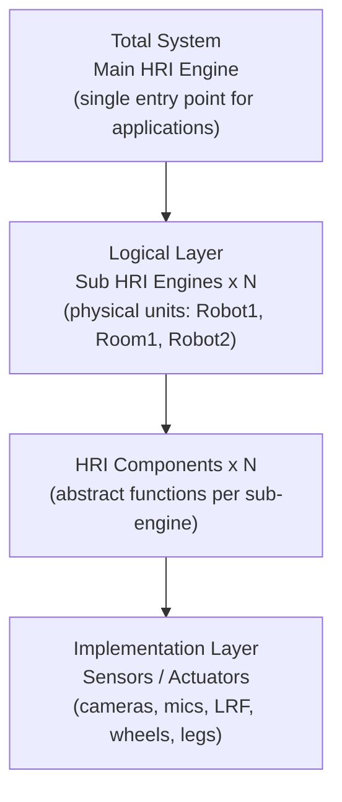

# Background: The RoIS Framework

## What RoIS is

RoIS defines a **platform-independent model (PIM)** of a framework that handles the
messages and data exchanged between HRI service components and service
applications. The central idea: a service application interacts with robots on the
**symbolic level** rather than the **physical level**. Messages carry only symbolic
data. Raw sensor data (image buffers, audio streams) is never carried in RoIS
messages. Symbolic results can be fed directly into conditional logic in a robot
scenario.

RoIS is developed by JARA, ETRI, KAR, and the Object Management Group (OMG). The
current version is **2.0-beta2** (OMG document dtc/2025-09-22). The normative
machine-readable files include IDL/HPP headers, component XML profiles, an
XML-Profiles schema, and an OWL ontology.

## Framework structure

The framework is organized in three conceptual layers:

Key rules from the specification:

- A system may consist of **multiple physical units**. Each is a sub HRI Engine. The
  whole system is the main HRI Engine that contains them.
- The application talks to **only the main HRI Engine**. Selection and switching
  between sub-engines and components happens engine-side and is invisible to the
  application.
- One physical unit can host more than one function, so physical units and
  functional units are defined separately (no one-to-one mapping).

## The five interfaces

RoIS exposes one System interface plus three information-exchange interfaces, plus a
Streaming interface layered on the others.

| Interface | Direction and style | Key operations |
|-----------|---------------------|----------------|
| System | Connection management, synchronous | `connect`, `disconnect`, `get_profile`, `get_error_detail` |
| Command | App to Engine, async execution | `search`, `bind`, `bind_any`, `release`, `get_parameter`, `set_parameter`, `execute`, `get_command_result` |
| Query | App to Engine, synchronous | `query` |
| Event | Engine to App, async notifications | `subscribe`, `unsubscribe`, `get_event_detail`, `notify_event` |
| Streaming | Two-way stream control | `connect_stream`, `disconnect_stream`, `suspend_stream`, `resume_stream`, `query_stream_status`, `notify_stream_status` |

## Command execution model

Because a component may be shared by multiple applications, command usage follows a
three-step reservation pattern:

1. **Bind**: `search(condition)` returns candidate `component_ref`s, then
   `bind(component_ref)` reserves one. Optionally `get_parameter` / `set_parameter`.
2. **Execute**: `execute(command_unit_list)` sends a command message and returns a
   `command_id` immediately. The operation runs asynchronously. Completion arrives
   via `completed(command_id, status)`. Detailed results via
   `get_command_result(command_id)`.
3. **Release**: `release(component_ref)` frees the component.

The `command_unit_list` can express **sequential and parallel** command operations
through `CommandUnitSequence` containing `CommandMessage` and `ConcurrentCommands`
entries.

## What RoIS does not define

RoIS defines messages, not transport. The C++ and CORBA platform-specific models
(PSMs) define method signatures only. RoIS messages can run over CORBA, RTC,
ROS/ROS 2 (DDS), WebSocket, or any transport. Interoperability is scoped to within a
single transport. RoIS also does not define media codecs. Streaming media formats are
out of scope. This separation of message from transport is central to the OpenRoIS
architecture.