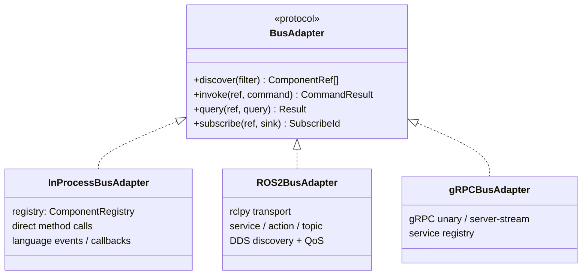

# The BusAdapter Contract

The `BusAdapter` is the single abstraction that decouples the engine from any
paradigm. The engine, gateway, and SDK depend only on this four-method contract. They
never reference ROS, DDS, gRPC, or a game engine.

## Method semantics

| Method | Purpose | ROS 2 mapping | InProcess mapping | gRPC mapping |
|--------|---------|---------------|-------------------|--------------|
| `discover` | Find components by condition | DDS discovery | registry lookup | service registry |
| `invoke` | Execute a command (start, stop, execute, set_parameter) | ROS 2 action or service | direct method call | gRPC unary |
| `query` | Synchronous read (component_status, get_parameter) | ROS 2 service | direct method call | gRPC unary |
| `subscribe` | Async event push (notify_event, notify_stream_status) | ROS 2 topic subscription | callback / language event | gRPC server-stream |

## RoIS operation to BusAdapter method mapping

The RoIS interface operations map to BusAdapter methods as follows:

- Synchronous operations (`query`, `get_parameter`, `component_status`) map to
  `query`.
- Command and long-running operations (`execute`, `start`, `set_parameter`) map to
  `invoke`.
- Async push operations (`notify_event`, `notify_stream_status`) map to `subscribe`
  plus an event sink.

## Why four methods

The contract is deliberately kept to four methods. Adding transport-specific knobs
(QoS policies, deadlines, reliability) to the contract would leak paradigm
assumptions into the engine. Instead, QoS, deadlines, and reliability belong to
whichever adapter needs them. Only the ROS 2 adapter needs DDS QoS. The in-process
adapter does not. Keeping the contract minimal means the engine can drive a ROS 2
robot fleet, an in-process avatar, or a distributed set of gRPC services with the
same code path.

Because the engine sees only `BusAdapter`, accidental coupling (for example, baking
DDS QoS semantics into the engine) is structurally prevented. The same contract test
suite runs against every adapter, catching paradigm leakage.