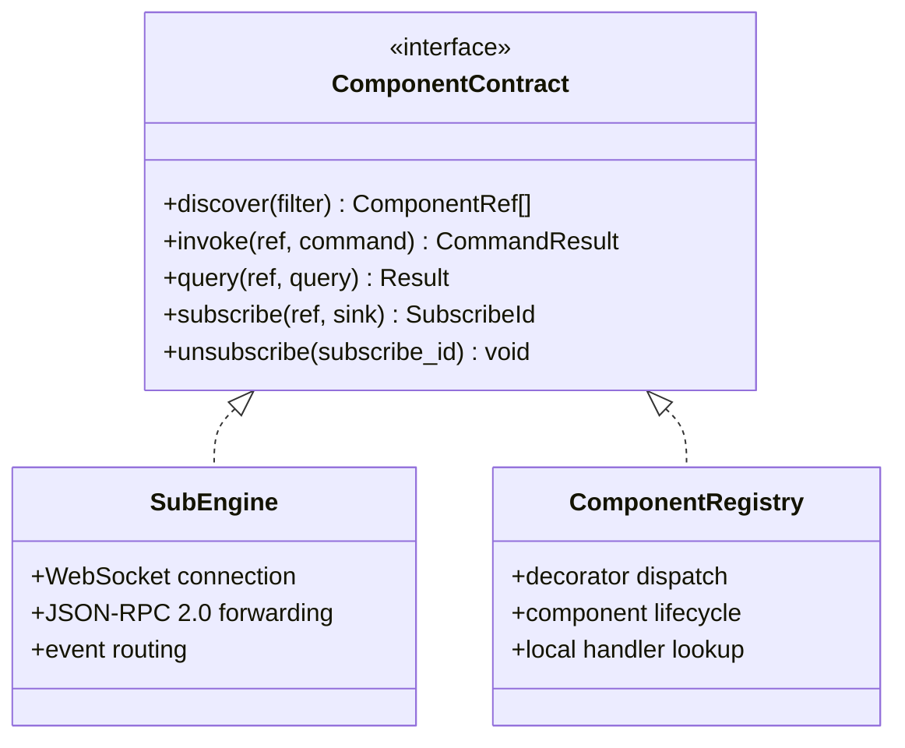

# The Component Contract

The `Component Contract` is the contract between the engine and the components it
manages. The engine and SDK depend only on this five-method contract. They never
reference ROS, DDS, gRPC, or a game engine. The `SubEngine` proxy implements it
remotely (forwarding over WebSocket to a child engine). The `ComponentRegistry`
implements it locally (dispatching to component handlers via decorators).

`SubEngine` is the remote implementation: the engine's proxy for a child engine
(an adapter) over WebSocket. `ComponentRegistry` is the local implementation: the
engine's direct dispatch to component handlers via decorators. The engine calls
the contract. It does not know which implementation it is calling.

## 6.1 Method semantics

| Method | Purpose | Example |
|--------|---------|---------|
| `discover` | Find components by condition | Adapter registers components at startup, gateway filters by scope |
| `invoke` | Execute a command (start, stop, execute, set_parameter) | Gateway forwards JSON-RPC to adapter, adapter dispatches to component |
| `query` | Synchronous read (component_status, get_parameter) | Gateway forwards JSON-RPC to adapter, adapter returns result |
| `subscribe` | Async event push (notify_event, notify_stream_status) | Gateway subscribes, adapter pushes events via WebSocket |
| `unsubscribe` | Cancel an event subscription | Gateway forwards unsubscribe, adapter stops pushing |

## 6.2 RoIS operation to Component Contract method mapping

The RoIS interface operations map to Component Contract methods as follows:

- Synchronous operations (`query`, `get_parameter`, `component_status`) map to
  `query`.
- Command and long-running operations (`execute`, `start`, `set_parameter`) map to
  `invoke`.
- Async push operations (`notify_event`, `notify_stream_status`) map to `subscribe`
  plus an event sink.

## 6.3 Why five methods

The contract is deliberately kept to five methods. Adding data-plane-specific knobs
(QoS policies, deadlines, reliability) to the contract would leak paradigm
assumptions into the engine. Instead, QoS, deadlines, and reliability belong
to the data plane of whichever adapter needs them. A ROS 2 adapter needs DDS QoS.
A gRPC adapter does not. Keeping the contract minimal means the engine can
drive a gRPC robot, a ROS 2 robot fleet, a virtual avatar, or a set of AI services
with the same control-plane code path.

Because the engine sees only `Component Contract`, accidental coupling (for example,
baking DDS QoS semantics into the engine) is structurally prevented. The same
contract test suite runs against every adapter, catching paradigm leakage.

## 6.4 Four contracts

OpenRoIS defines four distinct contracts at four boundaries:

1. **Service application to Gateway** (control plane): JSON-RPC 2.0 over WebSocket.
   The service application sends RoIS operations, the gateway routes them to the
   engine.
2. **Gateway to Adapter** (control plane): the `Component Contract` (discover,
   invoke, query, subscribe, unsubscribe) over WebSocket + JSON-RPC. The engine
   forwards calls to the adapter that owns the target component.
3. **Adapter to Component** (control plane): RoIS operations dispatched by the
   `ComponentRegistry` to component handler methods. The framework uses decorators
   (`@component`, `@query`, `@invoke`, `@subscribe`) to route JSON-RPC to the
   right method on the right component instance.
4. **Component to backend** (data plane): the functional implementation. gRPC,
   DDS, IPC, WebRTC, cloud API, or any other transport. This is not a middleware
   boundary. The component owns this connection.