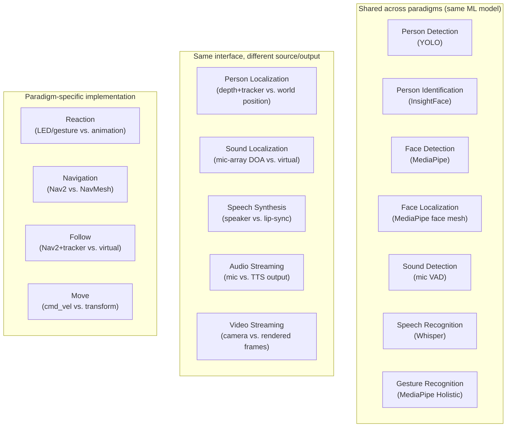

# Component Library and Package Management

## 14.1 The 17 basic components

RoIS defines 17 basic HRI components. Every component (except System Information)
shares the `RoIS_Common` interface: `start`, `stop`, `suspend`, `resume`, and
`component_status`. About 70% of components are identical across paradigms. The
perception and speech components run the same ML models whether the input is a robot
camera or a webcam. Only actuation, world model, and stream source differ.

| Component | Robot backend | Avatar backend | Shared? |
|-----------|---------------|----------------|---------|
| Person Detection | YOLO on camera | YOLO on webcam | yes |
| Person Localization | depth + tracker | world position | diff coord system |
| Person Identification | InsightFace | InsightFace | yes |
| Face Detection | MediaPipe | MediaPipe | yes |
| Face Localization | MediaPipe face mesh | MediaPipe face mesh | yes |
| Sound Detection | mic VAD | mic VAD | yes |
| Sound Localization | mic-array DOA | mic-array DOA / virtual | diff |
| Speech Recognition | Whisper | Whisper | yes |
| Gesture Recognition | MediaPipe Holistic | MediaPipe Holistic | yes |
| Speech Synthesis | TTS to speaker | TTS to lip-sync | diff output |
| Reaction | LED / gesture | animation / expression | paradigm-specific |
| Navigation | Nav2 (physical) | NavMesh (virtual) | paradigm-specific |
| Follow | Nav2 + tracker | virtual follow | paradigm-specific |
| Move | `cmd_vel` to motors | transform to avatar | paradigm-specific |
| Audio Streaming | mic to WebRTC | TTS output to WebRTC | diff source |
| Video Streaming | camera to WebRTC | rendered frames to WebRTC | diff source |
| System Information | battery, CPU, joints | FPS, memory, avatar state | diff state |

The component's logic is the same across adapters. Only the binding differs.

## 14.2 User-defined and non-canonical components

The spec supports user-defined components beyond the basic 17, reusing
`RoIS_Common` and the profile mechanism (spec section 12). An HRI Component Profile
can include another profile via `sub_component`, so an extended component can reuse
a base component's messages and add new ones.

OpenRoIS uses this mechanism for robot-specific components that are not in the 17
basic components. For example, a `NavigationInformation` component provides
destination lists and map data for a specific robot. It is user-defined,
non-canonical, and valid per the spec.

## 14.3 Component packages and multiple backends

Components are distributed as packages (e.g., `openrois_components.kachaka`). When a
component supports multiple backends (e.g., gRPC and ROS 2), the package ships one
class per backend: `GrpcNavigation` and `Ros2Navigation`. Both are decorated
`@component("Navigation")`. The adapter imports the one it needs. Selection happens
at import time, not at runtime. No factory, no Protocol, no runtime selection.

## 14.4 Package management boundary

The engine stays pure. It routes, aggregates profiles, tracks binds. It never
installs packages, resolves dependencies, or manages component lifecycle setup.
Package management is a process feature:

- The gateway `Api` exposes management endpoints: list installed component
  packages, enable or disable a package for a fleet, configure a package,
  health-check. This is the foundation for the management surface.
- The adapter `ComponentRegistry` loads component packages from a configured source
  (local path, git URL, or a registry endpoint). The adapter imports the package,
  instantiates components, and registers them with the gateway over the
  `Component Contract`. Dependency setup (Python venv, ROS 2 workspace, model
  weights) is the adapter's job, not the engine's.

The exact mechanism is undecided, but the boundary is decided: package management
lives in the `Api` (gateway) and the `ComponentRegistry` loader (adapter), never in
the `Engine`.