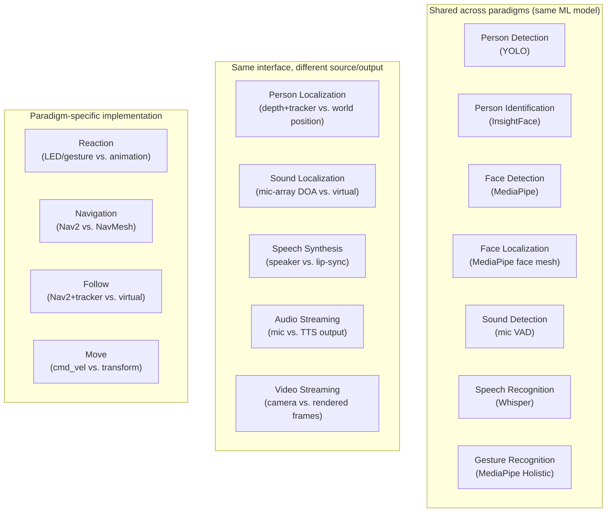

# Component Library

RoIS defines 17 basic HRI components. Every component (except System Information)
shares the `RoIS_Common` interface: `start`, `stop`, `suspend`, `resume`, and
`component_status`. About 70% of components are identical across paradigms. The
perception and speech components run the same ML models whether the input is a robot
camera or a webcam. Only actuation, world model, and stream source differ.

| Component | Robot backend | Avatar backend | Shared? |
|-----------|---------------|----------------|---------|
| Person Detection | YOLO on camera | YOLO on webcam | yes |
| Person Localization | depth + tracker | world position | diff coord system |
| Person Identification | InsightFace | InsightFace | yes |
| Face Detection | MediaPipe | MediaPipe | yes |
| Face Localization | MediaPipe face mesh | MediaPipe face mesh | yes |
| Sound Detection | mic VAD | mic VAD | yes |
| Sound Localization | mic-array DOA | mic-array DOA / virtual | diff |
| Speech Recognition | Whisper | Whisper | yes |
| Gesture Recognition | MediaPipe Holistic | MediaPipe Holistic | yes |
| Speech Synthesis | TTS to speaker | TTS to lip-sync | diff output |
| Reaction | LED / gesture | animation / expression | paradigm-specific |
| Navigation | Nav2 (physical) | NavMesh (virtual) | paradigm-specific |
| Follow | Nav2 + tracker | virtual follow | paradigm-specific |
| Move | `cmd_vel` to motors | transform to avatar | paradigm-specific |
| Audio Streaming | mic to WebRTC | TTS output to WebRTC | diff source |
| Video Streaming | camera to WebRTC | rendered frames to WebRTC | diff source |
| System Information | battery, CPU, joints | FPS, memory, avatar state | diff state |

The component's logic is the same across adapters. Only the binding differs. The
spec also supports user-defined components beyond the basic 17, reusing `RoIS_Common`
and the profile mechanism. An HRI Component Profile can include another profile via
`sub_component`, so an extended component can reuse a base component's messages and
add new ones.