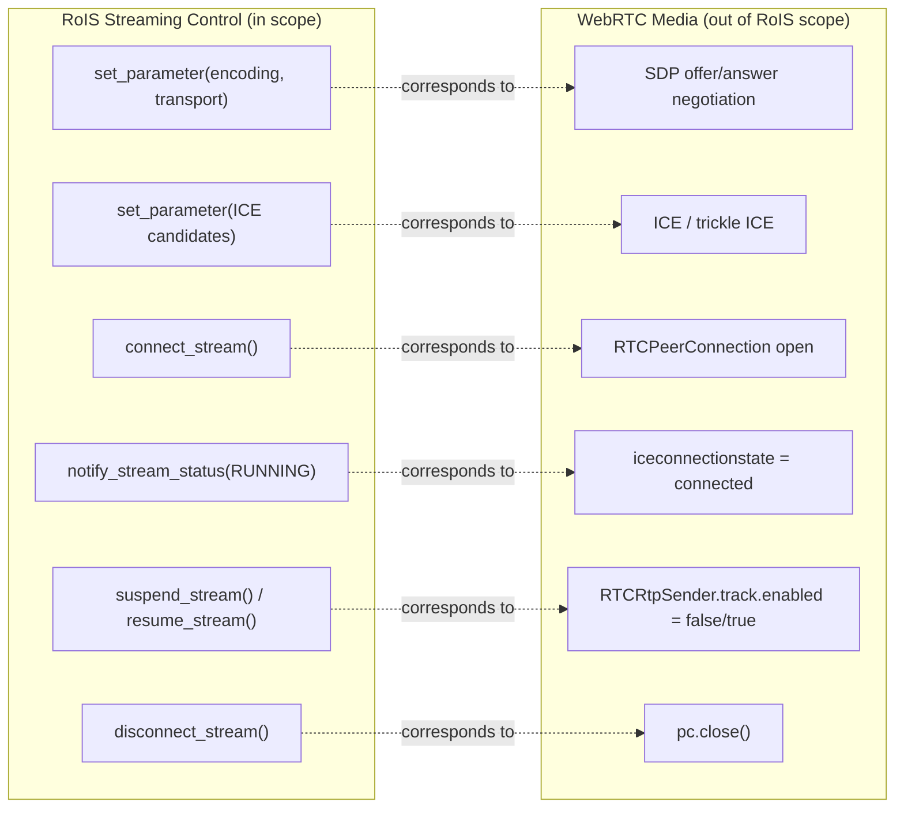

# Control Plane vs. Data Plane

RoIS defines only the streaming **control plane**. The media **data plane** is out
of scope, which makes WebRTC a natural fit.

WebRTC signaling travels over the existing WebSocket RoIS connection (passed as
`set_parameter` arguments), so no separate signaling server is required.

An important distinction the specification preserves: Speech Synthesis is a
**command** component (text to robot speaker locally), not a stream. Audio and Video
Streaming are **stream-control** components (live media robot to operator), using
WebRTC.

## P2P vs. SFU

- **Fleet of 1 to 3 robots**: peer-to-peer WebRTC is sufficient.
- **Larger fleets**: route media through a Selective Forwarding Unit (mediasoup,
  LiveKit). The RoIS streaming control interface is identical either way. The SFU is
  an implementation detail of the gateway.