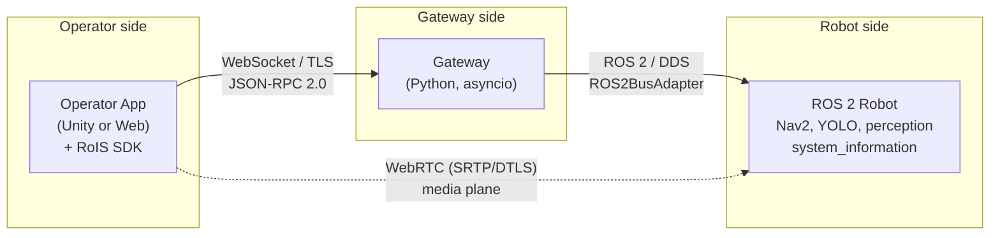
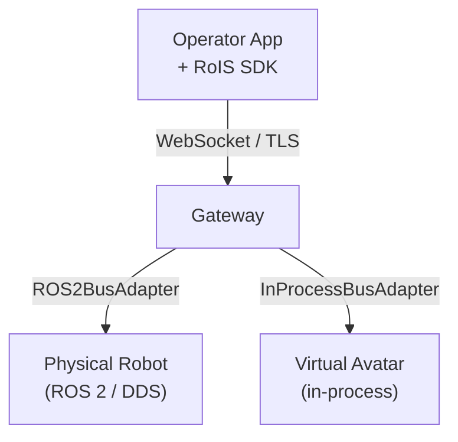
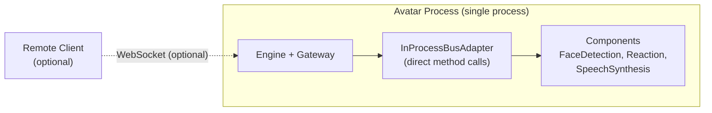
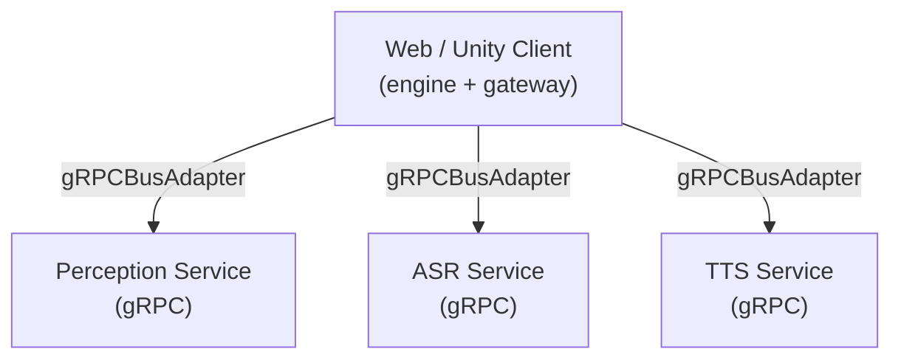

# Deployment Topologies

The same four layers compose into different physical deployments. The client SDK and
gateway are constant. Only the BusAdapter and host layout change.

## Topology A: Physical robot with web/Unity operator (primary)

The reference scenario: an operator application controls a ROS 2 robot over the
internet. The robot runs a sub-engine and component nodes. The Python gateway
bridges DDS to the remote client over WebSocket.

This is the primary demonstrated path and the MVP target (M5). From a clean checkout,
an operator can bring up the gateway and mock robot and control it from a browser or
Unity application.

## Topology B: Mixed fleet (multiple adapters at once)

One gateway can host several adapters simultaneously. For example, a physical robot
(ROS 2) and a virtual concierge avatar (in-process) behind the same SDK endpoint.
This is the strongest proof the interfaces are paradigm-neutral.

The mixed-paradigm test (M8) demonstrates that `search()` returns components from both
adapters, and the SDK controls each identically through one endpoint.

## Topology C: Single-process avatar (secondary)

The simplest deployment: engine, gateway, and components live in one process (for
example, a Unity game, a Godot app, or a Node/browser runtime). No serialization, no
network bus.

This topology is ideal for development and testing. It requires no external
dependencies and runs the full RoIS lifecycle in memory.

## Topology D: Multi-process services (secondary)

A front-end plus separate AI services (perception, ASR/TTS) that may run on a GPU box
or in containers.

This topology suits deployments where perception or speech models run on dedicated
GPU hardware, accessed as gRPC services.