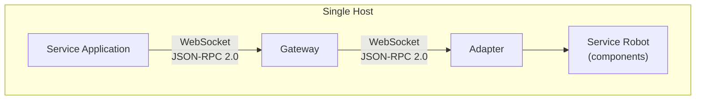
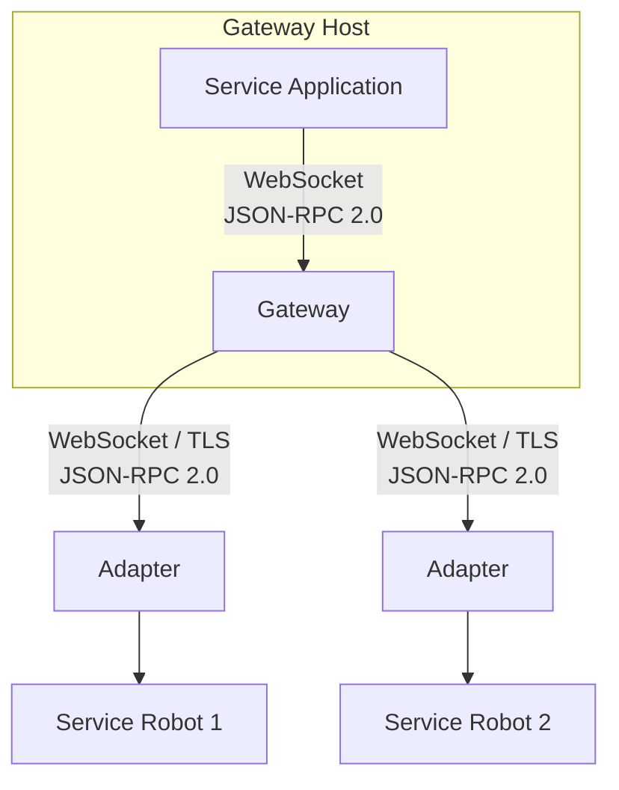
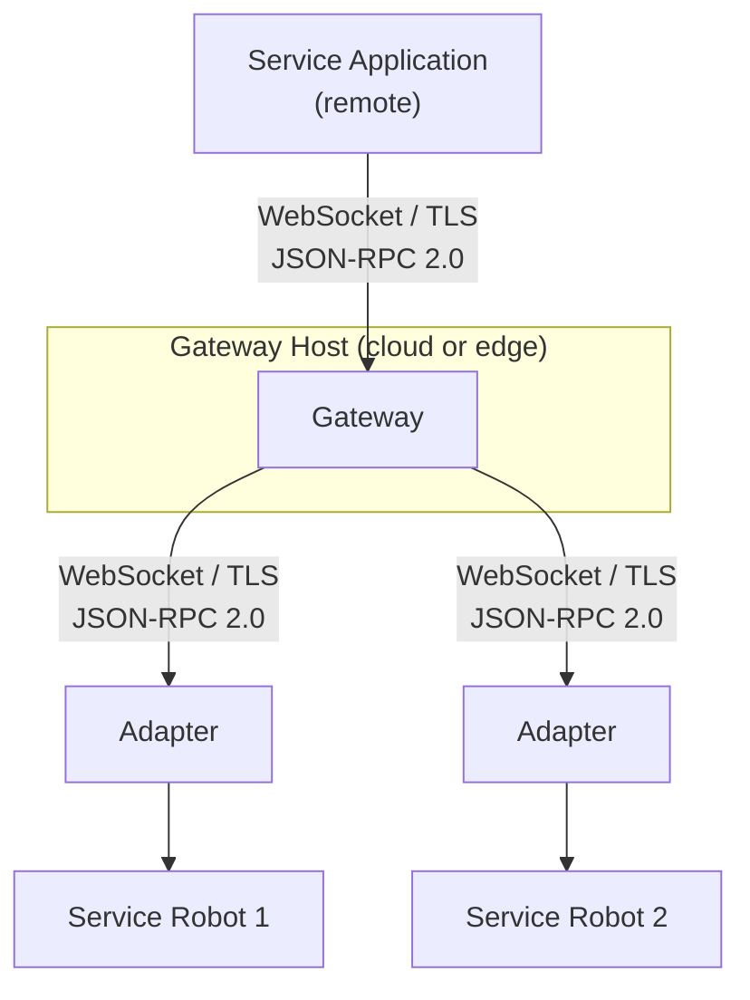
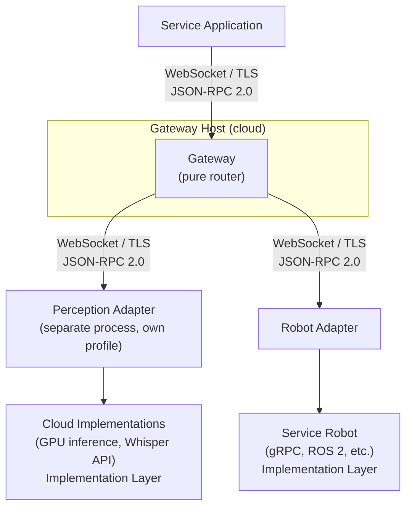

# Deployment Topologies

The control plane is always WebSocket + JSON-RPC 2.0, regardless of topology. Each
adapter's data-plane transport (gRPC, DDS, WebRTC, WHEP/WHIP, RTSP, IPC, or any
other) is an implementation detail of the adapter, not a topology choice. Topologies
differ by **where processes run**: on a single host, across a LAN, across the
internet, or with components offloaded to the cloud.

## 10.1 Topology A: Single host (local)

Everything runs on one machine: the service application, the gateway, the adapter,
and the robot. The service application talks to the gateway over localhost WebSocket.
The adapter connects to the gateway over localhost WebSocket. This is the simplest
deployment, useful for development, testing, and single-robot scenarios where the
robot's onboard computer runs everything.

```mermaid
flowchart TB
    subgraph Host["Single Host"]
        App["Service Application"]
        GW["Gateway"]
        Adapter["Adapter"]
        Robot["Service Robot<br/>(components)"]
        App -->|"WebSocket<br/>JSON-RPC 2.0"| GW
        GW -->|"WebSocket<br/>JSON-RPC 2.0"| Adapter
        Adapter --> Robot
    end
```

## 10.2 Topology B: LAN, multiple service robots

The gateway runs on one host. Multiple service robots run on the same LAN, each
with its own adapter. The service application connects to the gateway, which routes
calls to the correct robot's adapter. This is the fleet scenario: one gateway
serves multiple robots on a local network.

```mermaid
flowchart TB
    subgraph GatewayHost["Gateway Host"]
        App["Service Application"]
        GW["Gateway"]
        App -->|"WebSocket<br/>JSON-RPC 2.0"| GW
    end

    GW -->|"WebSocket / TLS<br/>JSON-RPC 2.0"| Adapter1["Adapter"]
    Adapter1 --> Robot1["Service Robot 1"]

    GW -->|"WebSocket / TLS<br/>JSON-RPC 2.0"| Adapter2["Adapter"]
    Adapter2 --> Robot2["Service Robot 2"]
```

## 10.3 Topology C: Distributed hosts (internet)

The service application runs on a remote host (operator's laptop, cloud service).
The gateway runs on a server or in the cloud. Each service robot runs on its own
host, connecting to the gateway over the internet. This is the full teleoperation
scenario: the operator is in one location, the gateway is in another, and the
robots are in a third.

```mermaid
flowchart TB
    App["Service Application<br/>(remote)"]
    App -->|"WebSocket / TLS<br/>JSON-RPC 2.0"| GW

    subgraph Cloud["Gateway Host (cloud or edge)"]
        GW["Gateway"]
    end

    GW -->|"WebSocket / TLS<br/>JSON-RPC 2.0"| Adapter1["Adapter"]
    Adapter1 --> Robot1["Service Robot 1"]

    GW -->|"WebSocket / TLS<br/>JSON-RPC 2.0"| Adapter2["Adapter"]
    Adapter2 --> Robot2["Service Robot 2"]
```

## 10.4 Topology D: Cloud perception (separate adapter)

Perception components (PersonDetection, SpeechRecognition) may need more compute
than the robot has. These run as a **separate adapter process** with its own
profile, connecting to the gateway over WebSocket like any other adapter. The
components run on the adapter (the translation layer) and connect to cloud-based
implementations (GPU inference services, TTS/STT APIs). The gateway is always a
pure router. It never hosts components directly.

```mermaid
flowchart TB
    App["Service Application"]
    App -->|"WebSocket / TLS<br/>JSON-RPC 2.0"| GW

    subgraph Cloud["Gateway Host (cloud)"]
        GW["Gateway<br/>(pure router)"]
    end

    GW -->|"WebSocket / TLS<br/>JSON-RPC 2.0"| PerceptionAdapter["Perception Adapter<br/>(separate process, own profile)"]
    PerceptionAdapter --> CloudImpl["Cloud Implementations<br/>(GPU inference, Whisper API)<br/>Implementation Layer"]

    GW -->|"WebSocket / TLS<br/>JSON-RPC 2.0"| RobotAdapter["Robot Adapter"]
    RobotAdapter --> Robot["Service Robot<br/>(gRPC, ROS 2, etc.)<br/>Implementation Layer"]
```

The gateway is a pure router in all topologies. Cloud perception is a separate
adapter process, not a `runtime` field in a robot's profile. The service application
does not know or care where a component's implementation lives: `search()` returns
components from all adapters, and `bind()` / `execute()` work identically.