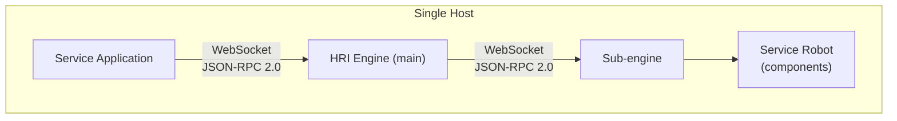
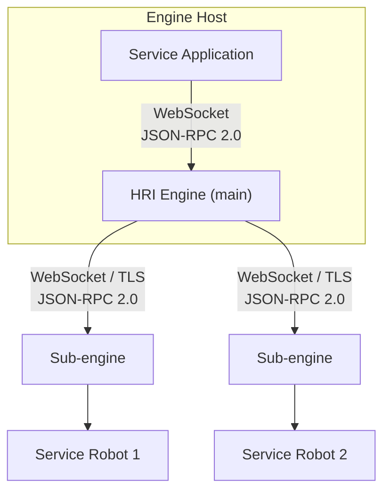
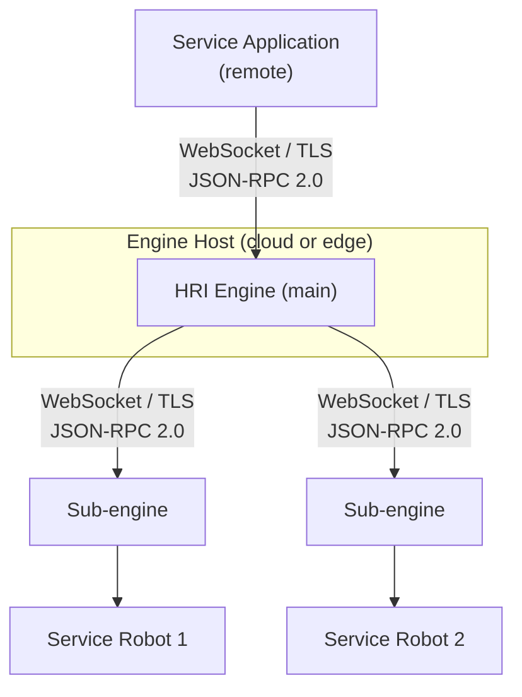
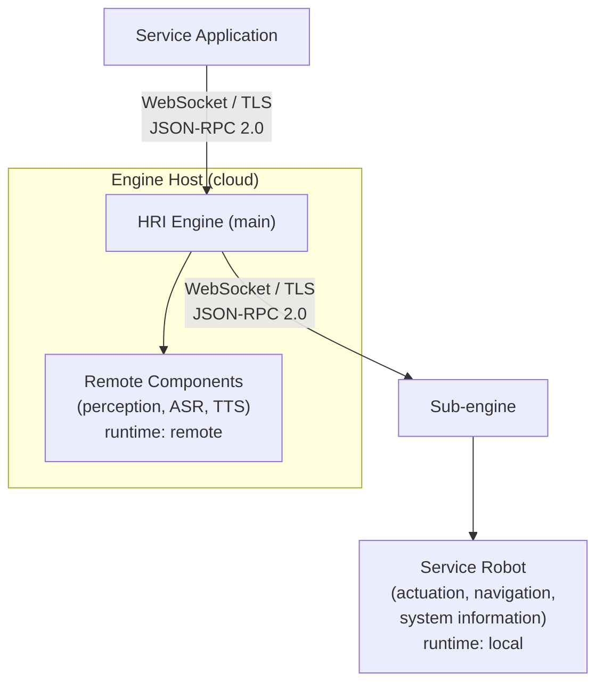

# Deployment Topologies

The engine-to-sub-engine boundary is always WebSocket + JSON-RPC. The sub-engine's
internal transport (DDS, gRPC, animation API, or any future paradigm) is an
implementation detail of the sub-engine, not a topology choice. Topologies differ by
**where processes run**: on a single host, across a LAN, across the internet, or
with components offloaded to the cloud.

## Topology A: Single host (local)

Everything runs on one machine: the service application, the engine, the sub-engine,
and the robot. The service application talks to the engine over localhost WebSocket.
The sub-engine connects to the engine over localhost WebSocket. This is the simplest
deployment, useful for development, testing, and single-robot scenarios where the
robot's onboard computer runs everything.

```mermaid
flowchart TB
    subgraph Host["Single Host"]
        App["Service Application"]
        GW["HRI Engine (main)"]
        SubEngine["Sub-engine"]
        Robot["Service Robot<br/>(components)"]
        App -->|"WebSocket<br/>JSON-RPC 2.0"| GW
        GW -->|"WebSocket<br/>JSON-RPC 2.0"| SubEngine
        SubEngine --> Robot
    end
```

## Topology B: LAN, multiple service robots

The engine runs on one host. Multiple service robots run on the same LAN, each with
its own sub-engine. The service application connects to the engine, which routes calls
to the correct robot's sub-engine. This is the fleet scenario: one engine serves
multiple robots on a local network.

```mermaid
flowchart TB
    subgraph EngineHost["Engine Host"]
        App["Service Application"]
        GW["HRI Engine (main)"]
        App -->|"WebSocket<br/>JSON-RPC 2.0"| GW
    end

    GW -->|"WebSocket / TLS<br/>JSON-RPC 2.0"| SubEngine1["Sub-engine"]
    SubEngine1 --> Robot1["Service Robot 1"]

    GW -->|"WebSocket / TLS<br/>JSON-RPC 2.0"| SubEngine2["Sub-engine"]
    SubEngine2 --> Robot2["Service Robot 2"]
```

## Topology C: Distributed hosts (internet)

The service application runs on a remote host (operator's laptop, cloud service).
The engine runs on a server or in the cloud. Each service robot runs on its own
host, connecting to the engine over the internet. This is the full teleoperation
scenario: the operator is in one location, the engine is in another, and the
robots are in a third.

```mermaid
flowchart TB
    App["Service Application<br/>(remote)"]
    App -->|"WebSocket / TLS<br/>JSON-RPC 2.0"| GW

    subgraph Cloud["Engine Host (cloud or edge)"]
        GW["HRI Engine (main)"]
    end

    GW -->|"WebSocket / TLS<br/>JSON-RPC 2.0"| SubEngine1["Sub-engine"]
    SubEngine1 --> Robot1["Service Robot 1"]

    GW -->|"WebSocket / TLS<br/>JSON-RPC 2.0"| SubEngine2["Sub-engine"]
    SubEngine2 --> Robot2["Service Robot 2"]
```

## Topology D: Cloud-hosted components

Some components run on the engine itself, not on the robot. The sub-engine on the
robot registers components with `runtime: remote` in the profile. The engine loads
and hosts those components directly. This suits components that need more compute
than the robot has (perception models, speech recognition) or components that are
shared across multiple robots. The sub-engine still owns `runtime: local`
components (actuation, navigation, system information).

```mermaid
flowchart TB
    App["Service Application"]
    App -->|"WebSocket / TLS<br/>JSON-RPC 2.0"| GW

    subgraph Cloud["Engine Host (cloud)"]
        GW["HRI Engine (main)"]
        RemoteComponents["Remote Components<br/>(perception, ASR, TTS)<br/>runtime: remote"]
        GW --> RemoteComponents
    end

    GW -->|"WebSocket / TLS<br/>JSON-RPC 2.0"| SubEngine["Sub-engine"]
    SubEngine --> Robot["Service Robot<br/>(actuation, navigation,<br/>system information)<br/>runtime: local"]
```

In Topology C, the engine is a pure router: all components live on the robot behind
the sub-engine. In Topology D, the engine is both a router and a component runtime.
Some components run on the engine (cloud), some run on the robot (local). The
`runtime` field in the profile declares where each component runs. The service
application does not know or care where a component runs: `search()` returns
components from both locations, and `bind()` / `execute()` work identically.