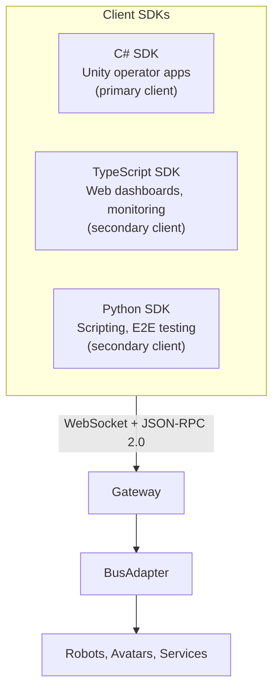

# Developer Experience: Three SDKs

OpenRoIS ships three client SDKs, each targeting a different developer audience.
All three expose the same five RoIS interfaces (System, Command, Query, Event,
Streaming) and produce identical behavior regardless of the host paradigm behind the
gateway.



## C# SDK for Unity (primary client)

The C# SDK (`OpenRoIS.Sdk` / `org.openrois.sdk`) is the primary client SDK, targeting
Unity operator applications. It connects to the gateway over WebSocket using
JSON-RPC 2.0, with async connect, auto-reconnect, token handling, heartbeat, and
typed errors. Component proxies provide typed access to each RoIS component with
event handlers.

```csharp
var engine = await RoISEngine.ConnectAsync(
    "wss://gateway.example.com",
    new ConnectOptions { Token = token });

var pd = await engine.BindAsync("PersonDetection");
var nav = await engine.BindAsync("Navigation");

pd.On("person_detected", e => UpdateCount(e.Number));
await pd.StartAsync();

await nav.ExecuteAsync(new TargetPosition(x: 3.0f, y: 1.5f, theta: 0f));
```

Key characteristics:

- Packaged for Unity via UPM (`org.openrois.sdk`) and NuGet (`OpenRoIS.Sdk`).
- Targets `netstandard2.1` for Unity 6.3+ (Mono) through Unity 6.8 (CoreCLR).
- SDK callbacks are marshaled to the Unity main thread (documented pattern, tested
  in Play Mode).
- Typed component proxies: `engine.BindAsync("PersonDetection")` returns a typed
  proxy with `.On(event)` handlers.

## TypeScript SDK for web (secondary client)

The TypeScript SDK (`@openrois/sdk`) serves non-Unity web applications: operator
dashboards, monitoring tools, configuration UIs, and automated testing. It runs in
both browsers and Node.js.

```ts
import { RoISEngine } from "@openrois/sdk";

const engine = await RoISEngine.connect("wss://gateway.example.com", {
  token: await getAccessToken(),
});

const pd = await engine.bind("PersonDetection");
pd.on("person_detected", (e) => console.log(`${e.number} people`));
await pd.start();

const nav = await engine.bind("Navigation");
await nav.execute({ target_positions: ["3.0,1.5,0.0"], time_limit: 30 });

const video = await engine.bind("VideoStreaming");
const track = await video.connectStream();    // WebRTC track to video element
```

Key characteristics:

- TypeScript strict mode, no `any`, no implicit returns.
- Runtime validation via zod schemas imported from `@openrois/interfaces`.
- Dual ESM/CJS output (tsup), browser and Node.js compatible.
- Auto-reconnect with exponential backoff, heartbeat, typed error hierarchy.
- Ships with a mock gateway (`integration/mock-gateway/`) for testing all SDKs.

## Python SDK for scripting (secondary client)

The Python SDK (`openrois-sdk`) mirrors the core API for scripting, automated
testing of the gateway and ROS 2 adapter, and E2E validation. It reuses the same
protocol surface defined by the other SDKs.

```python
import asyncio
from openrois.sdk import RoISEngine

async def main():
    engine = await RoISEngine.connect(
        "wss://gateway.example.com",
        token=get_access_token(),
    )

    pd = await engine.bind("PersonDetection")
    pd.on("person_detected", lambda e: print(f"{e.number} people"))
    await pd.start()

    nav = await engine.bind("Navigation")
    await nav.execute(target_positions=["3.0,1.5,0.0"], time_limit=30)

asyncio.run(main())
```

Key characteristics:

- Built on the same Pydantic types that are the source of truth for the entire
  project, so there is no type bridge needed.
- Used for E2E testing of the gateway and ROS 2 adapter.
- Async-first (asyncio), mirroring the engine and gateway runtime.

## SDK interface mapping

All three SDKs mirror the five RoIS interfaces defined in the normative IDL:

| RoIS Interface | SDK client | Key operations |
|----------------|-----------|----------------|
| SystemIF | `SystemClient` | `connect()`, `disconnect()`, `getProfile()`, `getErrorDetail()` |
| CommandIF | `CommandClient` | `search()`, `bind()`, `bindAny()`, `release()`, `getParameter()`, `setParameter()`, `execute()`, `getCommandResult()` |
| QueryIF | `QueryClient` | `query()` |
| EventIF | `EventClient` | `subscribe()`, `unsubscribe()`, `getEventDetail()`, callback: `onNotifyEvent` |
| Streaming | `StreamClient` | `connectStream()`, `disconnectStream()`, `suspendStream()`, `resumeStream()`, `queryStreamStatus()` |

The callback surface comes directly from `ServiceApplicationBase` in the
specification: `notify_error`, `completed`, and `notify_event`.

## Paradigm transparency

The same SDK calls drive a real ROS 2 robot and an in-process avatar. Only the host
behind the gateway changes. This is the core value proposition for researchers: a
scenario written once can be tested against a mock robot, deployed against a real
ROS 2 robot, and reused against a virtual avatar without code changes.