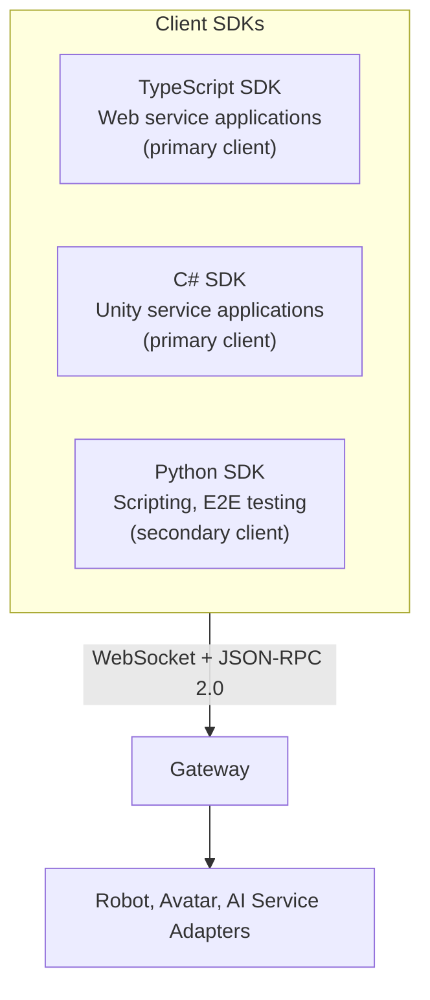

# Developer Experience: Three SDKs

OpenRoIS ships three client SDKs, each targeting a different developer audience.
All three expose the same five RoIS interfaces (System, Command, Query, Event,
Streaming) and produce identical behavior regardless of the host paradigm behind the
gateway.


```mermaid
flowchart TB
    subgraph SDKs["Client SDKs"]
        direction LR
        TS["TypeScript SDK<br/>Web service applications<br/>(primary client)"]
        CSharp["C# SDK<br/>Unity service applications<br/>(primary client)"]
        Py["Python SDK<br/>Scripting, E2E testing<br/>(secondary client)"]
    end

    SDKs -->|"WebSocket + JSON-RPC 2.0"| Gateway["Gateway"]
    Gateway --> Adapters["Robot, Avatar, AI Service Adapters"]
```

## 8.1 TypeScript SDK for web (primary client)

The TypeScript SDK (`@openrois/sdk`) is the primary client SDK for web service
applications. It connects to the gateway over WebSocket using JSON-RPC 2.0, with
auto-reconnect, profile-driven discovery, and typed errors.

```ts
import { RoISClient } from "@openrois/sdk";

const client = await RoISClient.connect("wss://gateway.example.com", {
  token: await getAccessToken(),
});

const components = await client.search();

const status = await client.query("kachaka_01/Navigation", "component_status");

const subId = await client.subscribe("kachaka_01/Navigation", "reached_target");
client.on("rois.event.notify", (event) => {
  console.log("Navigation event:", event);
});

await client.bind("kachaka_01/Navigation");
await client.setParameter("kachaka_01/Navigation", [
  { name: "target_positions", data_type_ref: "string[]", value: '["home"]' },
]);
await client.execute("kachaka_01/Navigation", {
  command_type: "start",
  command_id: `cmd-${Date.now()}`,
  parameters: [],
});

await client.disconnect();
```

Key characteristics:

- TypeScript strict mode, no `any`, no implicit returns.
- Runtime validation via zod schemas imported from `@openrois/interfaces`.
- Dual ESM/CJS output (tsup), browser and Node.js compatible.
- Auto-reconnect with exponential backoff, typed error hierarchy.
- Ships with a mock engine (`examples/mock-engine/`) for testing.

## 8.2 C# SDK for Unity (primary client)

The C# SDK (`OpenRoIS.Sdk` / `org.openrois.sdk`) targets Unity service
applications. It connects to the gateway over WebSocket using JSON-RPC 2.0, with
async connect, auto-reconnect, token handling, and typed errors.

```csharp
var client = await RoISClient.ConnectAsync(
    "wss://gateway.example.com",
    new ConnectOptions { Token = token });

var pd = await client.BindAsync("PersonDetection");
var nav = await client.BindAsync("Navigation");

pd.On("person_detected", e => UpdateCount(e.Number));
await pd.StartAsync();

await nav.ExecuteAsync(new TargetPosition(x: 3.0f, y: 1.5f, theta: 0f));
```

Key characteristics:

- Packaged for Unity via UPM (`org.openrois.sdk`) and NuGet (`OpenRoIS.Sdk`).
- Targets `netstandard2.1` for Unity 6.3+ (Mono) through Unity 6.8 (CoreCLR).
- SDK callbacks are marshaled to the Unity main thread (documented pattern, tested
  in Play Mode).
- Typed component proxies: `client.BindAsync("PersonDetection")` returns a typed
  proxy with `.On(event)` handlers.

## 8.3 Python SDK for scripting (secondary client)

The Python SDK (`openrois-sdk`) mirrors the core API for scripting, automated
testing, and E2E validation. It also includes the `ComponentRegistry` and
`WsClient` for adapter authors.

```python
import asyncio
from openrois.sdk import RoISClient

async def main():
    client = await RoISClient.connect(
        "wss://gateway.example.com",
        token=get_access_token(),
    )

    pd = await client.bind("PersonDetection")
    pd.on("person_detected", lambda e: print(f"{e.number} people"))
    await pd.start()

    nav = await client.bind("Navigation")
    await nav.execute(target_positions=["3.0,1.5,0.0"], time_limit=30)

asyncio.run(main())
```

Key characteristics:

- Built on the same Pydantic types that are the source of truth for the entire
  project, so there is no type bridge needed.
- Used for E2E testing of the gateway and adapters.
- Async-first (asyncio), mirroring the gateway runtime.

## 8.4 SDK interface mapping

All three SDKs mirror the five RoIS interfaces defined in the normative IDL:

| RoIS Interface | SDK client | Key operations |
|----------------|-----------|----------------|
| SystemIF | `SystemClient` | `connect()`, `disconnect()`, `getProfile()`, `getErrorDetail()` |
| CommandIF | `CommandClient` | `search()`, `bind()`, `bindAny()`, `release()`, `getParameter()`, `setParameter()`, `execute()`, `getCommandResult()` |
| QueryIF | `QueryClient` | `query()` |
| EventIF | `EventClient` | `subscribe()`, `unsubscribe()`, `getEventDetail()`, callback: `onNotifyEvent` |
| StreamingIF | `StreamClient` | `connectStream()`, `disconnectStream()`, `suspendStream()`, `resumeStream()`, `queryStreamStatus()` |

The callback surface comes directly from `ServiceApplicationBase` in the
specification: `notify_error`, `completed`, and `notify_event`.

## 8.5 Paradigm transparency

The same SDK calls drive a real ROS 2 robot and a virtual avatar. Only the adapter
behind the gateway changes. This is the core value proposition for researchers: a
scenario written once can be tested against a mock robot, deployed against a real
ROS 2 robot, and reused against a virtual avatar without code changes.