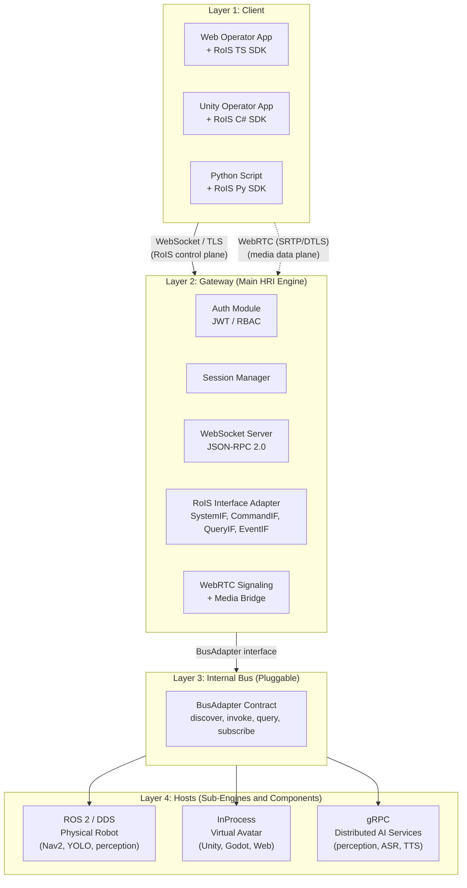

# Layered Architecture

OpenRoIS is organized in four layers. The client SDK and gateway are constant across
all deployments. Only the BusAdapter and host layout change.

The spec's "main HRI Engine" maps to the **Gateway** (Layer 2). Each "sub HRI Engine"
maps to a **per-host node** (Layer 4): a robot node, an avatar process, or a service.
"HRI Components" map to whatever the chosen BusAdapter addresses: in-process objects,
gRPC services, or ROS 2 component nodes. The client only ever talks to the gateway.
The host topology and paradigm are hidden, exactly as the specification requires.

## Mapping RoIS concepts to OpenRoIS layers

| RoIS concept | OpenRoIS implementation | Layer |
|-------------|------------------------|-------|
| Main HRI Engine | Gateway (Python, asyncio) | 2 |
| Sub HRI Engine | Per-host node (robot node, avatar process, service) | 4 |
| HRI Component | In-process object, gRPC service, or ROS 2 node | 4 |
| Service Application | Client SDK (C#, TypeScript, or Python) | 1 |
| RoIS interfaces (SystemIF, CommandIF, QueryIF, EventIF, Streaming) | JSON-RPC 2.0 methods over WebSocket | 1 to 2 |
| Transport (unspecified by RoIS) | BusAdapter contract + concrete adapters | 3 |

## Gateway responsibilities

The gateway is the only internet-facing process and the single enforcement point for
security. It:

- Terminates the remote transport (WebSocket/TLS) and authenticates every connection
  before any RoIS message is processed.
- Translates JSON-RPC RoIS calls to bus adapter operations (service/action/topic for
  ROS 2, method calls for in-process, gRPC for distributed services).
- Aggregates profiles from all authorized sub-engines into one `HRI_Engine_Profile`
  returned by `get_profile()`.
- Filters `search()` and `query()` results and guards `bind()` and `execute()` per
  the caller's authorization scope.
- Relays WebRTC signaling (SDP/ICE) over the same WebSocket connection and bridges
  media through an SFU when needed.