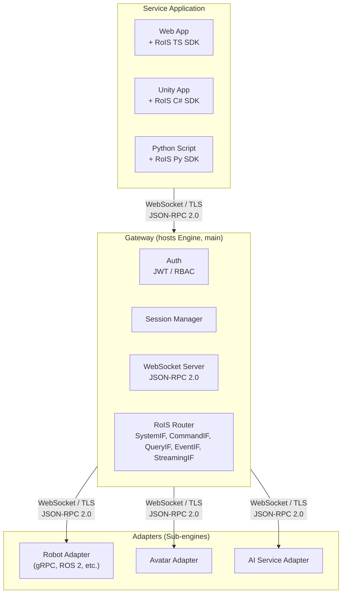

# Layered Architecture

OpenRoIS is organized in three roles: the service application, the gateway, and
adapters. The gateway is a control-plane router. Adapters are standalone processes
that own their data-plane transport. All middleware boundaries use WebSocket +
JSON-RPC 2.0.

```mermaid
flowchart TB
    subgraph L1["Service Application"]
        direction LR
        WebApp["Web App<br/>+ RoIS TS SDK"]
        UnityApp["Unity App<br/>+ RoIS C# SDK"]
        PyScript["Python Script<br/>+ RoIS Py SDK"]
    end

    subgraph L2["Gateway (hosts Engine, main)"]
        direction LR
        Auth["Auth<br/>JWT / RBAC"]
        Session["Session Manager"]
        WSServer["WebSocket Server<br/>JSON-RPC 2.0"]
        Router["RoIS Router<br/>SystemIF, CommandIF, QueryIF, EventIF, StreamingIF"]
    end

    subgraph L3["Adapters (Sub-engines)"]
        direction LR
        RobotAdapter["Robot Adapter<br/>(gRPC, ROS 2, etc.)"]
        AvatarAdapter["Avatar Adapter"]
        ServiceAdapter["AI Service Adapter"]
    end

    L1 -->|"WebSocket / TLS<br/>JSON-RPC 2.0"| L2
    L2 -->|"WebSocket / TLS<br/>JSON-RPC 2.0"| RobotAdapter
    L2 -->|"WebSocket / TLS<br/>JSON-RPC 2.0"| AvatarAdapter
    L2 -->|"WebSocket / TLS<br/>JSON-RPC 2.0"| ServiceAdapter
```

The spec's "main HRI Engine" maps to the **engine** hosted by the gateway. Each
"sub HRI Engine" maps to an **adapter** (a standalone process hosting the same
`Engine` class with local components, connecting to the gateway via WebSocket).
"HRI Components" map to the components registered by each adapter. The service
application only ever talks to the gateway. The host paradigm is hidden, exactly
as the specification requires.

The engine has zero media imports, zero WebRTC imports, and zero references to
ROS, DDS, gRPC, or any game engine. The control plane is WebSocket + JSON-RPC
2.0, no alternatives. Media and other data-plane traffic flows directly between
the publisher and the consumer, outside the gateway. The engine is a pure
control-plane router when acting as the main engine.

## 5.1 Mapping RoIS concepts to OpenRoIS layers

| RoIS concept | OpenRoIS implementation | Role |
|-------------|------------------------|-------|
| Main HRI Engine | Engine (hosted by the gateway) | Routes to child engines, aggregates profiles |
| Sub HRI Engine | Engine (hosted by an adapter) | Hosts local components, owns data-plane transport |
| HRI Component | Component registered by an adapter | Translation layer: RoIS calls to backend calls |
| Service Application | Client SDK (TypeScript, C#, or Python) | Drives robot scenarios via RoIS interfaces |
| RoIS interfaces (SystemIF, CommandIF, QueryIF, EventIF, StreamingIF) | JSON-RPC 2.0 methods over WebSocket | Service application to gateway boundary (control plane) |
| Component Contract | WebSocket + JSON-RPC 2.0 (gateway-to-adapter boundary) | Gateway to adapter boundary |

## 5.2 Gateway responsibilities

The gateway is the only internet-facing process and the single enforcement point
for security. It:

- Terminates the control-plane transport (WebSocket/TLS) and authenticates every
  connection before any RoIS message is processed.
- Routes JSON-RPC RoIS calls to the appropriate adapter based on component ref.
- Aggregates profiles from all authorized adapters into one `HRI_Engine_Profile`
  returned by `get_profile()`.
- Filters `search()` and `query()` results and guards `bind()` and `execute()`
  per the caller's authorization scope.
- Brokers media descriptor exchange via the RoIS streaming interface, never
  touches media data.