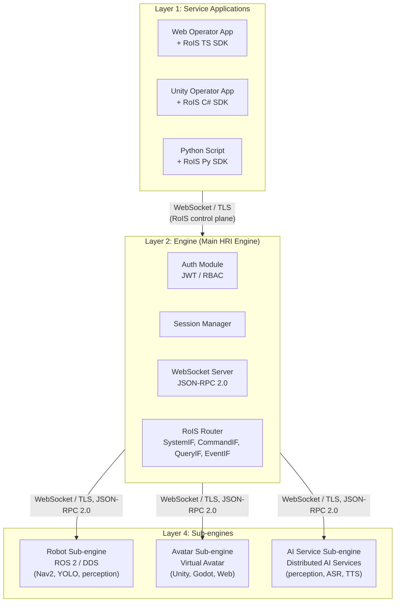

# Layered Architecture

OpenRoIS is organized in three roles: service application, engine, and sub-engines.
The engine-to-sub-engine boundary is always WebSocket + JSON-RPC.

The Hub (`apps/hub/`) is a web application (Vite + React) that serves as a
visualizer of the Engine. It connects to the Engine via WebSocket using
`@openrois/sdk` with `WebSocketTransport`. It is a dashboard for monitoring and
inspecting the Engine's state, registered components, and active sessions. It is
not a service application. It can issue RoIS commands (search, query) to populate
its views, but its primary role is visualization, not driving robot scenarios. A
proper service application (teleop, patrol, follow-person) is a separate concern
and lives in `apps/` alongside the Hub.

```mermaid
flowchart TB
    subgraph L1["Layer 1: Service Applications"]
        direction LR
        WebApp["Web Operator App<br/>+ RoIS TS SDK"]
        UnityApp["Unity Operator App<br/>+ RoIS C# SDK"]
        PyScript["Python Script<br/>+ RoIS Py SDK"]
    end

    subgraph L2["Layer 2: Engine (Main HRI Engine)"]
        direction LR
        Auth["Auth Module<br/>JWT / RBAC"]
        Session["Session Manager"]
        WSServer["WebSocket Server<br/>JSON-RPC 2.0"]
        RoISRouter["RoIS Router<br/>SystemIF, CommandIF, QueryIF, EventIF"]
    end

    subgraph L4["Layer 4: Sub-engines"]
        direction LR
        Robot["Robot Sub-engine<br/>ROS 2 / DDS<br/>(Nav2, YOLO, perception)"]
        Avatar["Avatar Sub-engine<br/>Virtual Avatar<br/>(Unity, Godot, Web)"]
        Services["AI Service Sub-engine<br/>Distributed AI Services<br/>(perception, ASR, TTS)"]
    end

    L1 -->|"WebSocket / TLS<br/>(RoIS control plane)"| L2
    L2 -->|"WebSocket / TLS, JSON-RPC 2.0"| Robot
    L2 -->|"WebSocket / TLS, JSON-RPC 2.0"| Avatar
    L2 -->|"WebSocket / TLS, JSON-RPC 2.0"| Services
```

The spec's "main HRI Engine" maps to the **Engine** (Layer 2). Each "sub HRI Engine"
maps to a **sub-engine** (Layer 4): a robot sub-engine, an avatar sub-engine, or an AI
service sub-engine. "HRI Components" map to whatever the sub-engine owns: ROS 2 component
nodes, animation APIs, or gRPC services. The client only ever talks to the engine.
The host topology and paradigm are hidden, exactly as the specification requires.

## Mapping RoIS concepts to OpenRoIS roles

| RoIS concept | OpenRoIS implementation | Role |
|-------------|------------------------|------|
| Main HRI Engine | Engine | Engine |
| Sub HRI Engine | Sub-engine (standalone process) | Sub-engine |
| HRI Component | ROS 2 node, animation API, or gRPC service | Sub-engine |
| Service Application | Client SDK (C#, TypeScript, or Python) | Service application |
| RoIS interfaces (SystemIF, CommandIF, QueryIF, EventIF, Streaming) | JSON-RPC 2.0 methods over WebSocket | Service application to Engine |
| Transport (unspecified by RoIS) | SubEngine contract (WebSocket + JSON-RPC) | Engine to Sub-engine |

## Engine responsibilities

The engine is the only internet-facing process and the single enforcement point for
security. It:

- Terminates the remote transport (WebSocket/TLS) and authenticates every connection
  before any RoIS message is processed.
- Routes JSON-RPC RoIS calls to the appropriate sub-engine.
- Aggregates profiles from all authorized sub-engines into one `HRI_Engine_Profile`
  returned by `get_profile()`.
- Filters `search()` and `query()` results and guards `bind()` and `execute()` per
  the caller's authorization scope.
- Brokers media descriptor exchange via the RoIS streaming interface, never touches
  media data.