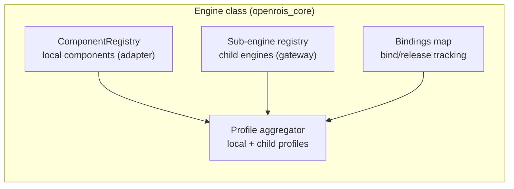
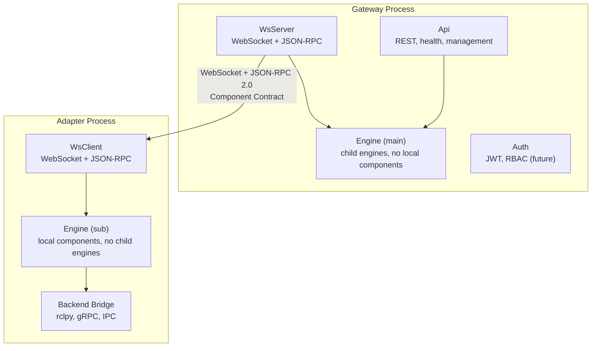

# The Recursive Engine

The core architectural contribution of OpenRoIS is the recursive `Engine` class. The
engine is a recursive unit: it manages local components and routes RoIS calls to
child engines. The same `Engine` class is used by both the gateway and the adapter.
The difference is what is populated, not whether it is an engine.

## 4.1 The engine class

The `Engine` class is a Python library in `openrois_core`. It has:

- A `ComponentRegistry` for local components (populated when acting as a sub-engine).
- A sub-engine registry for child engines (populated when acting as the main engine).
- A bindings map for bind/release tracking (always present).
- A profile aggregator that combines local component profiles and child engine
  profiles.

When acting as the **main engine** (gateway), the `ComponentRegistry` is empty and
the sub-engine registry holds child engines connected over WebSocket. When acting
as a **sub-engine** (adapter), the sub-engine registry is empty and the
`ComponentRegistry` holds local components. The design supports nesting (child
engines with their own child engines), but this is not used today.

## 4.2 Processes are compositions

The gateway process composes `Engine` + `WsServer` + `Api` (and future `Auth`,
`Signaling`). The adapter process composes `Engine` + `WsClient` + a backend
bridge (rclpy, gRPC, IPC). Both use the same `Engine` class.

## 4.3 Why this eliminates the duplicate dispatch problem

Before the recursive engine model, the TypeScript `@openrois/engine` and the Python
`AdapterFramework` both implemented RoIS JSON-RPC dispatch logic, in two languages,
with no shared core. The recursive model dissolves this problem:

- One `Engine` class, one dispatch implementation. The gateway uses it with child
  engines. The adapter uses it with local components. Both are engines.
- The `Component Contract` is the generated interface from `interfaces/`. The
  `SubEngine` proxy implements it remotely (forwarding over WebSocket to a child
  engine). The `ComponentRegistry` implements it locally (dispatching to component
  handlers via decorators). The engine calls the contract. It does not know which
  implementation it is calling.
- The adapter IS an engine (a sub-engine), not a separate kind of process. It
  hosts local components and registers with a parent engine. This matches the RoIS
  spec: the Sub HRI Engine is an engine, not a passive backend.

**Current state:** a TypeScript engine POC exists and works. Phase 4 of the roadmap
replaces it with the Python `openrois_core` package using the recursive `Engine`
class.

## 4.4 The adapter as a sub-engine

The adapter process owns three concerns:

1. **Component hosting**: the `ComponentRegistry` imports component packages,
   instantiates components, manages their lifecycle (`connect`/`disconnect`), and
   dispatches RoIS calls to component handlers via decorators (`@component`,
   `@query`, `@invoke`, `@subscribe`).
2. **Gateway connection**: the `WsClient` connects to the gateway over WebSocket,
   registers components via `rois.adapter.register`, and forwards RoIS calls to
   the local `Engine`.
3. **Backend bridge**: the adapter loads a backend (rclpy, gRPC, IPC) based on its
   profile YAML. Each component owns its own connection to its backend, created in
   `connect()` and torn down in `disconnect()`.

The adapter is an engine. It dispatches RoIS calls to its local components. It
does not route calls between sub-engines (its sub-engine registry is empty). It
registers with the parent engine over WebSocket.