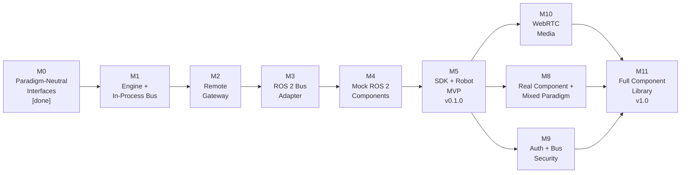

# Roadmap and Maturity

OpenRoIS is built in vertical slices. Each milestone delivers a working end-to-end
path, not an isolated layer.

| Milestone | Theme | Output | Status |
|-----------|-------|--------|--------|
| M0 | Paradigm-Neutral Interfaces | `interfaces` (Pydantic to JSON Schema to C#/TS), `BusAdapter` contract | done |
| M1 | Engine and In-Process Bus | `engine`, `InProcessBusAdapter`, mock components | todo |
| M2 | Remote Gateway | `gateway` (WebSocket, JSON-RPC 2.0, auth hook) | todo |
| M3 | ROS 2 Bus Adapter | `ROS2BusAdapter` (rclpy), no core changes | todo |
| M4 | Mock ROS 2 Robot Components | `person_detection`, `navigation`, `system_information` nodes | todo |
| M5 | SDK and Robot MVP | `sdk-csharp` / `sdk-js`, operator app, **v0.1.0 release** | todo |
| M8 | Real Robot Component and Mixed Paradigm | YOLO `person_detection`, robot + avatar on one gateway | todo |
| M9 | Auth and Bus Security | `auth`, `rbac`, per-fleet isolation | todo |
| M10 | WebRTC Media | Streaming components, telepresence | todo |
| M11 | Full Component Library | All 17 basic components, both paradigms, **v1.0** | todo |

The MVP is M5: the minimum that lets an operator clone, build, and control a ROS 2
robot from an application over WebSocket. The paradigm-neutrality proof is M8 (mixed
robot + avatar on one gateway). The 1.0 release is M11.

## Versioning

- `v0.x`: unstable, breaking changes may occur without notice.
- `v1.0` (M11): first stable release with semantic versioning guarantees.

## Current state

As of this writing, M0 is complete. The interface types are authored as Pydantic
models, exported to JSON Schema, and generated into C# and TypeScript. The
`BusAdapter` contract is defined and frozen for M1. Three of 17 basic components
(PersonDetection, Navigation, SystemInformation) have typed message models. The
remaining milestones are planned or under construction.