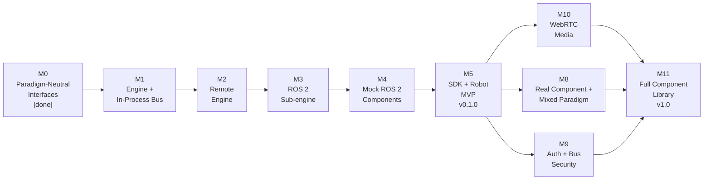

# Roadmap and Maturity

OpenRoIS is built in vertical slices. Each milestone delivers a working end-to-end
path, not an isolated layer.

```mermaid
flowchart LR
    M0["M0<br/>Paradigm-Neutral<br/>Interfaces<br/>[done]"] --> M1["M1<br/>Engine +<br/>In-Process Bus"]
    M1 --> M2["M2<br/>Remote<br/>Engine"]
    M2 --> M3["M3<br/>ROS 2<br/>Sub-engine"]
    M3 --> M4["M4<br/>Mock ROS 2<br/>Components"]
    M4 --> M5["M5<br/>SDK + Robot<br/>MVP<br/>v0.1.0"]
    M5 --> M8["M8<br/>Real Component +<br/>Mixed Paradigm"]
    M5 --> M9["M9<br/>Auth + Bus<br/>Security"]
    M5 --> M10["M10<br/>WebRTC<br/>Media"]
    M10 --> M11["M11<br/>Full Component<br/>Library<br/>v1.0"]
    M8 --> M11
    M9 --> M11
```

| Milestone | Theme | Output | Status |
|-----------|-------|--------|--------|
| M0 | Paradigm-Neutral Interfaces | `interfaces` (Pydantic to JSON Schema to C#/TS), `SubEngine` contract | done |
| M1 | Engine and In-Process Bus | `engine`, `RemoteSubEngine`, mock components | todo |
| M2 | Remote Engine | `engine` (WebSocket, JSON-RPC 2.0, auth hook) | todo |
| M3 | ROS 2 Sub-engine | ROS 2 sub-engine (rclpy), no core changes | todo |
| M4 | Mock ROS 2 Robot Components | `person_detection`, `navigation`, `system_information` nodes | todo |
| M5 | SDK and Robot MVP | `sdk-js`, web operator app, **v0.1.0 release** | todo |
| M8 | Real Robot Component and Mixed Paradigm | YOLO `person_detection`, robot + avatar on one engine | todo |
| M9 | Auth and Bus Security | `auth`, `rbac`, per-fleet isolation | todo |
| M10 | WebRTC Media | Streaming components, telepresence | todo |
| M11 | Full Component Library | All 17 basic components, both paradigms, **v1.0** | todo |

The MVP is M5: the minimum that lets an operator clone, build, and control a ROS 2
robot from a web application over WebSocket. The paradigm-neutrality proof is M8 (mixed
robot + avatar on one engine). The 1.0 release is M11.

## Versioning

- `v0.x`: unstable, breaking changes may occur without notice.
- `v1.0` (M11): first stable release with semantic versioning guarantees.

## Current state

As of this writing, M0 is complete. The interface types are authored as Pydantic
models, exported to JSON Schema, and generated into C# and TypeScript. The
`SubEngine` contract is defined and frozen for M1. Three of 17 basic components
(PersonDetection, Navigation, SystemInformation) have typed message models. The
remaining milestones are planned or under construction.