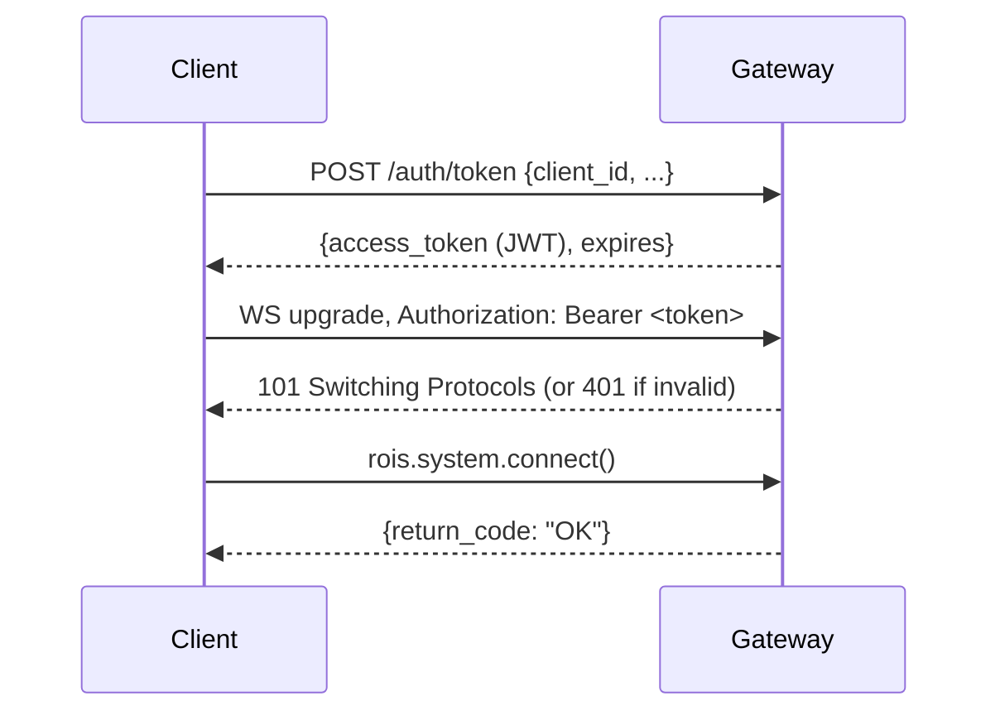
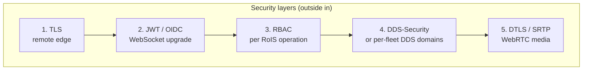

# Security Architecture

Security is phased but never bolted on. Auth hooks exist from M2 (the gateway
milestone). Full multi-tenant enforcement lands in M9.

## Authentication flow

The specification's `connect()` takes no parameters (it assumes a trusted LAN). For
remote access, OpenRoIS authenticates before any RoIS message is processed, at the
WebSocket upgrade.



Example JWT claims used downstream for authorization:

```json
{
  "sub": "operator-alice",
  "roles": ["operator"],
  "fleet_scope": ["warehouse-north", "lab-b"],
  "components": ["person_detection", "navigation", "video_streaming"],
  "iat": 1749500000,
  "exp": 1749503600
}
```

## Authorization model (RBAC)

Authorization is enforced per RoIS operation inside the gateway. The spec's
`Condition_t` (an ISO 19143 filter expression) and `component_ref` are the natural
enforcement points.

| Role | Fleet scope | Component scope |
|------|-------------|-----------------|
| admin | all | all |
| operator | assigned | assigned (including actuation) |
| viewer | assigned | detection + streaming only |
| maintenance | assigned | system_information |

## Enforcement points

| Interface / operation | Enforcement |
|-----------------------|-------------|
| `connect()` | Verify JWT. Expose only sub-engines within `fleet_scope`. |
| `search(condition)` | Filter `component_ref_list` to authorized fleet and components. |
| `bind(component_ref)` | Reject refs outside scope. |
| `execute(command_unit_list)` | Validate every `component_ref` in the sequence. |
| `query(query_type, condition)` | Filter results to authorized fleets. |
| `subscribe(event_type, condition)` | Deliver `notify_event` only for authorized sources. |
| `connect_stream()` | Require streaming scope. SFU enforces per-stream ACL. |

Because the gateway filters at `search()`, robots outside a caller's scope are
invisible. The caller cannot discover or address them.

## Defense in depth

