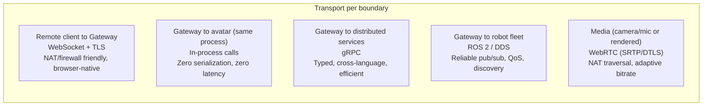

# Transport Strategy

OpenRoIS deliberately separates messages from transport, so the right transport is
used at each boundary rather than forcing one everywhere.

| Boundary | Transport | Rationale |
|----------|-----------|-----------|
| Remote client to Gateway | WebSocket + TLS | NAT/firewall friendly, browser-native, easy auth, async events. Matches the spec's Annex F.2.3 WebSocket example. |
| Gateway to avatar (same process) | In-process calls | Zero serialization and latency. Ideal for Unity, Godot, or Web hosts. |
| Gateway to distributed services | gRPC | Typed, cross-language, efficient. Good for GPU/AI services. |
| Gateway to robot fleet | ROS 2 / DDS | Reliable pub/sub, QoS, discovery, ecosystem (Nav2, perception). |
| Media (camera/mic or rendered) | WebRTC (SRTP/DTLS) | Built-in NAT traversal (ICE/STUN/TURN), adaptive bitrate, encrypted, browser-native. |

These are complementary, not competing. In-process, gRPC, and DDS each solve a
different host boundary. WebSocket solves the remote control boundary. WebRTC
solves real-time media. Each is selected by the active BusAdapter at Layer 3, except
WebSocket (always the remote edge) and WebRTC (always the media plane).