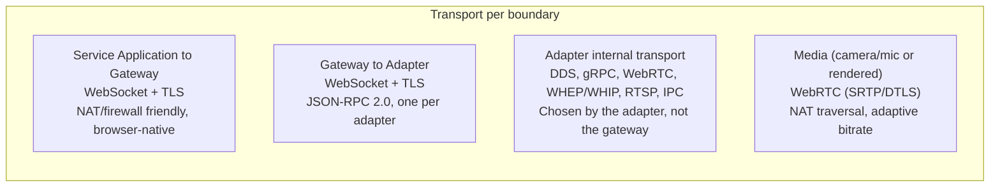

# Transport Strategy

OpenRoIS deliberately separates messages from transport, so the right transport is
used at each boundary rather than forcing one everywhere.

```mermaid
flowchart LR
    subgraph Boundaries["Transport per boundary"]
        direction TB
        B1["Service Application to Gateway<br/>WebSocket + TLS<br/>NAT/firewall friendly, browser-native"]
        B2["Gateway to Adapter<br/>WebSocket + TLS<br/>JSON-RPC 2.0, one per adapter"]
        B3["Adapter internal transport<br/>DDS, gRPC, WebRTC, WHEP/WHIP, RTSP, IPC<br/>Chosen by the adapter, not the gateway"]
        B4["Media (camera/mic or rendered)<br/>WebRTC (SRTP/DTLS)<br/>NAT traversal, adaptive bitrate"]
    end
```

| Boundary | Transport | Rationale |
|----------|-----------|-----------|
| Service Application to Gateway | WebSocket + TLS | NAT/firewall friendly, browser-native, easy auth, async events. Matches the spec's Annex F.2.3 WebSocket example. |
| Gateway to Adapter | WebSocket + TLS | JSON-RPC 2.0, one connection per adapter. The gateway-to-adapter boundary is always the same transport. |
| Adapter internal transport | DDS, gRPC, WebRTC, WHEP/WHIP, RTSP, IPC | Chosen by the adapter based on what its backend requires. The gateway does not know or care. |
| Media (camera/mic or rendered) | WebRTC (SRTP/DTLS) | Built-in NAT traversal (ICE/STUN/TURN), adaptive bitrate, encrypted, browser-native. |

All middleware boundaries use WebSocket + JSON-RPC 2.0. Each adapter's internal
transport (DDS, gRPC, WebRTC, WHEP/WHIP, RTSP, IPC) is chosen by the adapter, not
the gateway. WebSocket solves the remote control boundary. WebRTC solves real-time
media. The gateway never touches media data.