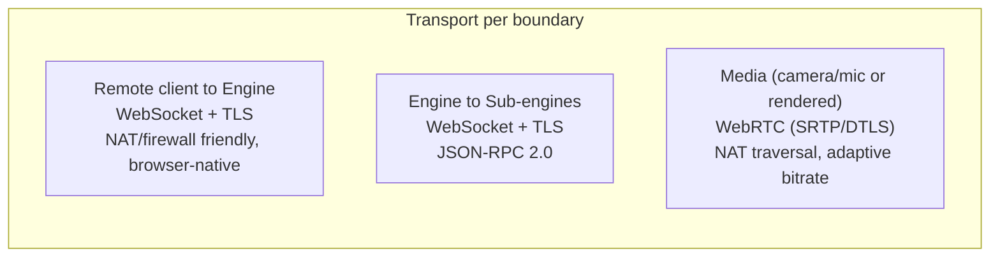

# Transport Strategy

OpenRoIS deliberately separates messages from transport, so the right transport is
used at each boundary rather than forcing one everywhere.

```mermaid
flowchart LR
    subgraph Boundaries["Transport per boundary"]
        direction TB
        B1["Remote client to Engine<br/>WebSocket + TLS<br/>NAT/firewall friendly, browser-native"]
        B4["Engine to Sub-engines<br/>WebSocket + TLS<br/>JSON-RPC 2.0"]
        B5["Media (camera/mic or rendered)<br/>WebRTC (SRTP/DTLS)<br/>NAT traversal, adaptive bitrate"]
    end
```

| Boundary | Transport | Rationale |
|----------|-----------|-----------|
| Remote client to Engine | WebSocket + TLS | NAT/firewall friendly, browser-native, easy auth, async events. Matches the spec's Annex F.2.3 WebSocket example. |
| Engine to Sub-engine | WebSocket + TLS | The engine-to-sub-engine boundary is always WebSocket + JSON-RPC. The sub-engine's internal transport is chosen by the sub-engine. |
| Media (camera/mic or rendered) | WebRTC (SRTP/DTLS) | Built-in NAT traversal (ICE/STUN/TURN), adaptive bitrate, encrypted, browser-native. |

These are complementary, not competing. The engine-to-sub-engine boundary is always
WebSocket + JSON-RPC. The sub-engine's internal transport (DDS, gRPC, animation API) is
chosen by the sub-engine, not the engine. WebSocket solves the remote control boundary.
WebRTC solves real-time media.