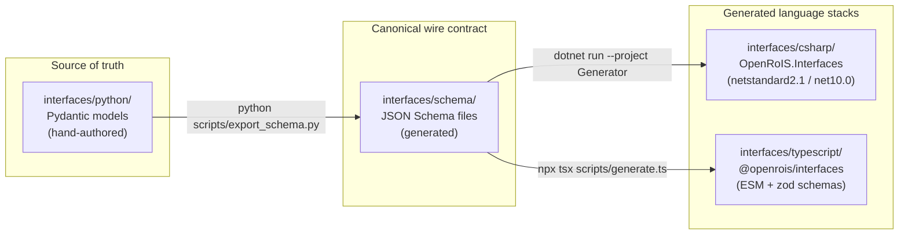

# Interface Type Pipeline

The RoIS interfaces are authored once in Python and generated into three language
stacks. This ensures type consistency without manual synchronization.



## Pipeline steps

1. **Author** Pydantic models in `interfaces/python/src/openrois/interfaces/`.
2. **Export** to JSON Schema: `cd python && python scripts/export_schema.py`.
3. **Generate** C#: `cd csharp/scripts/Generator && dotnet run -- ../../schema`.
4. **Generate** TypeScript: `cd typescript && npx tsx scripts/generate.ts`.

The pipeline runs in CI on every change to `interfaces/**`. A schema-drift test
verifies that committed JSON Schema files match the current Pydantic output. C# and
TypeScript types are never hand-written.

## Packages

| Package | Language | Registry | Status |
|---------|----------|----------|--------|
| `openrois-interfaces` | Python 3.12+ | PyPI | Source of truth (M0 complete) |
| `OpenRoIS.Interfaces` | C# (netstandard2.1) | NuGet / UPM | Generated (M0 complete) |
| `@openrois/interfaces` | TypeScript (ESM) | npm | Generated (M0 complete) |

## Typed message pattern

Instead of using the generic `Result(value=str)` for all event payloads, OpenRoIS
defines typed Pydantic models per component. For example, the PersonDetection
component's `person_detected` event is modeled as:

```python
class PersonDetectedEvent(BaseModel):
    timestamp: DateTime = Field(description="Time when measured")
    number: Integer = Field(description="Number of detected persons")
```

This provides compile-time safety in all three language stacks. The generic `Result`
type remains available as a JSON fallback for genuinely dynamic payloads, but the
preferred path is typed messages per component.

## Cross-validation

Types are cross-checked against the normative XML profiles
(`PersonDetection.xml`, `Navigation.xml`, `SystemInformation.xml`) and validated
against `XML-Profiles.xsd`. This ensures the generated types agree with the
specification's machine-readable artifacts, not just with each other.