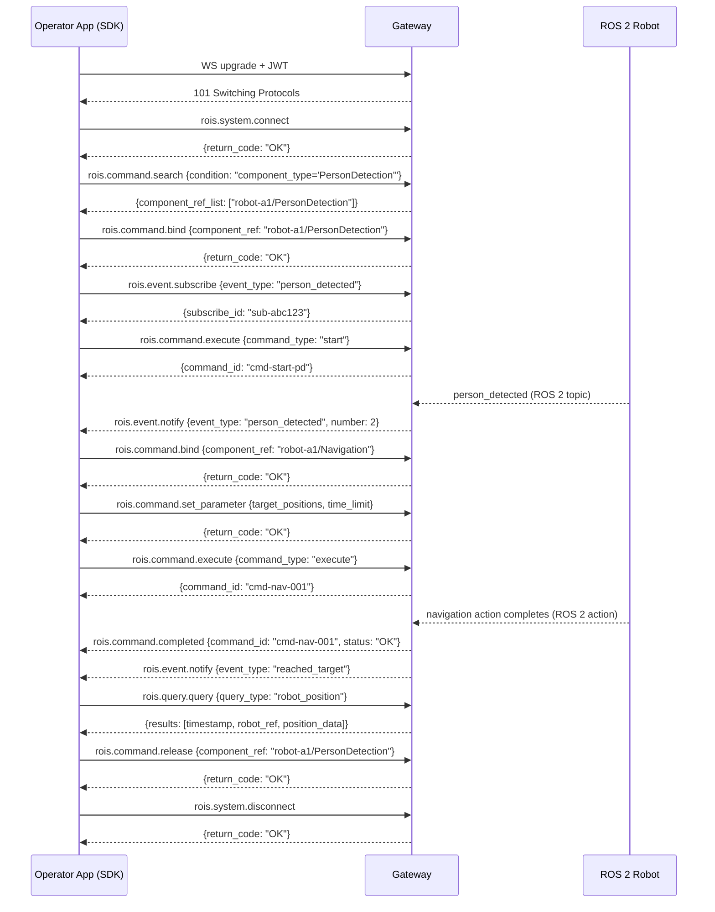

# The Wire Protocol: JSON-RPC 2.0

The remote client talks to the gateway over **WebSocket** using **JSON-RPC 2.0** as
the message envelope. Every RoIS interface operation maps to a JSON-RPC method in a
namespaced hierarchy. The gateway processes requests and sends responses, and also
pushes asynchronous notifications (events, command completions, errors) to the client
as JSON-RPC notifications (messages with no `id` field).

## Method namespaces

```
rois.system.*     SystemIF:    connect, disconnect, get_profile, get_error_detail
rois.command.*    CommandIF:   search, bind, release, get_parameter, set_parameter, execute, get_command_result
rois.query.*      QueryIF:     query
rois.event.*      EventIF:     subscribe, unsubscribe, get_event_detail
rois.stream.*     Streaming:   connect_stream, disconnect_stream, suspend_stream, resume_stream, query_stream_status
```

Server-to-client push (no `id` field, JSON-RPC notifications):

```
rois.event.notify          notify_event(event_id, event_type, subscribe_id, expire, results)
rois.system.notify_error   notify_error(error_id, error_type)
rois.command.completed     completed(command_id, status)
rois.stream.notify_status  notify_stream_status(stream_id, status)
```

## Full method catalog

### System interface (`rois.system.*`)

| Method | Params | Response |
|--------|--------|----------|
| `rois.system.connect` | `{}` | `{return_code: "OK"}` |
| `rois.system.disconnect` | `{}` | `{return_code: "OK"}` |
| `rois.system.get_profile` | `{condition: string}` | `{return_code, profile: string}` |
| `rois.system.get_error_detail` | `{error_id: string}` | `{return_code, results: Result[]}` |

### Command interface (`rois.command.*`)

| Method | Params | Response |
|--------|--------|----------|
| `rois.command.search` | `{condition: string}` | `{return_code, component_ref_list: string[]}` |
| `rois.command.bind` | `{component_ref: string}` | `{return_code}` |
| `rois.command.release` | `{component_ref: string}` | `{return_code}` |
| `rois.command.get_parameter` | `{component_ref, parameter_names: string[]}` | `{return_code, parameters: Parameter[]}` |
| `rois.command.set_parameter` | `{component_ref, parameters: Parameter[]}` | `{return_code}` |
| `rois.command.execute` | `{component_ref, command_unit_list: CommandUnitSequence}` | `{return_code, command_id: string}` |
| `rois.command.get_command_result` | `{command_id: string}` | `{return_code, results: Result[]}` |

### Query interface (`rois.query.*`)

| Method | Params | Response |
|--------|--------|----------|
| `rois.query.query` | `{component_ref, query_type: string, condition: string}` | `{return_code, results: Result[]}` |

### Event interface (`rois.event.*`)

| Method | Params | Response |
|--------|--------|----------|
| `rois.event.subscribe` | `{component_ref, event_type: string, condition: string}` | `{return_code, subscribe_id: string}` |
| `rois.event.unsubscribe` | `{subscribe_id: string}` | `{return_code}` |
| `rois.event.get_event_detail` | `{event_id: string}` | `{return_code, results: Result[]}` |

### Streaming interface (`rois.stream.*`)

| Method | Params | Response |
|--------|--------|----------|
| `rois.stream.connect_stream` | `{component_ref, parameters: Parameter[]}` | `{return_code, stream_id: string}` |
| `rois.stream.disconnect_stream` | `{stream_id: string}` | `{return_code}` |
| `rois.stream.suspend_stream` | `{stream_id: string}` | `{return_code}` |
| `rois.stream.resume_stream` | `{stream_id: string}` | `{return_code}` |
| `rois.stream.query_stream_status` | `{stream_id: string}` | `{return_code, status: StreamStatus}` |

## Core data types on the wire

All payloads use the types generated from the canonical JSON Schema. The key
structures:

**Result** (returned by `query`, `get_command_result`, `get_event_detail`):

```json
{
  "name": "number",
  "data_type_ref": "int",
  "value": "2"
}
```

**Parameter** (sent by `set_parameter`, returned by `get_parameter`):

```json
{
  "name": "target_positions",
  "data_type_ref": "string[]",
  "value": "[\"3.0,1.5,0.0\"]"
}
```

**CommandUnit** (element of a `CommandUnitSequence`):

```json
{
  "component_ref": "robot-a1/Navigation",
  "command_type": "execute",
  "command_id": "cmd-001",
  "arguments": [
    {"name": "target_positions", "data_type_ref": "string[]", "value": "[\"3.0,1.5,0.0\"]"},
    {"name": "time_limit", "data_type_ref": "int", "value": "30"}
  ]
}
```

**ReturnCode** values: `OK`, `ERROR`, `BAD_PARAMETER`, `UNSUPPORTED`,
`OUT_OF_RESOURCES`, `TIMEOUT`.

**ComponentStatus** values: `UNINITIALIZED`, `READY`, `BUSY`, `WARNING`, `ERROR`.

**CompletedStatus** values: `OK`, `ERROR`, `ABORT`, `OUT_OF_RESOURCES`, `TIMEOUT`.

**StreamStatus** values: `STREAMING_NOT_CONNECTED`, `STREAMING_NOT_RUNNING`,
`STREAMING_RUNNING`, `STREAMING_SUSPENDED`, `STREAMING_RESUMED`.

## End-to-end message flow examples

The following examples show the actual JSON-RPC messages exchanged during a
complete operator session: connect, search, bind, subscribe, execute, receive
events, query, and disconnect.

### Step 1: Connect

Client sends `rois.system.connect` (after WebSocket upgrade with JWT):

```json
{
  "jsonrpc": "2.0",
  "id": 1,
  "method": "rois.system.connect",
  "params": {}
}
```

Gateway responds:

```json
{
  "jsonrpc": "2.0",
  "id": 1,
  "result": {"return_code": "OK"}
}
```

### Step 2: Search for PersonDetection components

```json
{
  "jsonrpc": "2.0",
  "id": 2,
  "method": "rois.command.search",
  "params": {
    "condition": "component_type='PersonDetection'"
  }
}
```

Gateway responds with matching component references:

```json
{
  "jsonrpc": "2.0",
  "id": 2,
  "result": {
    "return_code": "OK",
    "component_ref_list": ["robot-a1/PersonDetection"]
  }
}
```

### Step 3: Bind the PersonDetection component

```json
{
  "jsonrpc": "2.0",
  "id": 3,
  "method": "rois.command.bind",
  "params": {
    "component_ref": "robot-a1/PersonDetection"
  }
}
```

```json
{
  "jsonrpc": "2.0",
  "id": 3,
  "result": {"return_code": "OK"}
}
```

### Step 4: Subscribe to person_detected events

```json
{
  "jsonrpc": "2.0",
  "id": 4,
  "method": "rois.event.subscribe",
  "params": {
    "component_ref": "robot-a1/PersonDetection",
    "event_type": "person_detected",
    "condition": ""
  }
}
```

```json
{
  "jsonrpc": "2.0",
  "id": 4,
  "result": {
    "return_code": "OK",
    "subscribe_id": "sub-abc123"
  }
}
```

### Step 5: Start the PersonDetection component

```json
{
  "jsonrpc": "2.0",
  "id": 5,
  "method": "rois.command.execute",
  "params": {
    "component_ref": "robot-a1/PersonDetection",
    "command_unit_list": {
      "command_unit_list": [
        {
          "component_ref": "robot-a1/PersonDetection",
          "command_type": "start",
          "command_id": "cmd-start-pd"
        }
      ]
    }
  }
}
```

```json
{
  "jsonrpc": "2.0",
  "id": 5,
  "result": {
    "return_code": "OK",
    "command_id": "cmd-start-pd"
  }
}
```

### Step 6: Gateway pushes a person_detected event (notification, no id)

```json
{
  "jsonrpc": "2.0",
  "method": "rois.event.notify",
  "params": {
    "event_id": "evt-001",
    "event_type": "person_detected",
    "subscribe_id": "sub-abc123",
    "expire": "2026-06-24T12:01:00Z",
    "results": [
      {"name": "timestamp", "data_type_ref": "DateTime", "value": "2026-06-24T12:00:30Z"},
      {"name": "number", "data_type_ref": "int", "value": "2"}
    ]
  }
}
```

### Step 7: Bind Navigation and set target position

```json
{
  "jsonrpc": "2.0",
  "id": 6,
  "method": "rois.command.bind",
  "params": {
    "component_ref": "robot-a1/Navigation"
  }
}
```

```json
{
  "jsonrpc": "2.0",
  "id": 6,
  "result": {"return_code": "OK"}
}
```

Set the navigation parameters:

```json
{
  "jsonrpc": "2.0",
  "id": 7,
  "method": "rois.command.set_parameter",
  "params": {
    "component_ref": "robot-a1/Navigation",
    "parameters": [
      {"name": "target_positions", "data_type_ref": "string[]", "value": "[\"3.0,1.5,0.0\"]"},
      {"name": "time_limit", "data_type_ref": "int", "value": "30"},
      {"name": "routing_policy", "data_type_ref": "string", "value": "time"}
    ]
  }
}
```

```json
{
  "jsonrpc": "2.0",
  "id": 7,
  "result": {"return_code": "OK"}
}
```

### Step 8: Execute the navigation command

```json
{
  "jsonrpc": "2.0",
  "id": 8,
  "method": "rois.command.execute",
  "params": {
    "component_ref": "robot-a1/Navigation",
    "command_unit_list": {
      "command_unit_list": [
        {
          "component_ref": "robot-a1/Navigation",
          "command_type": "execute",
          "command_id": "cmd-nav-001",
          "arguments": [
            {"name": "target_positions", "data_type_ref": "string[]", "value": "[\"3.0,1.5,0.0\"]"},
            {"name": "time_limit", "data_type_ref": "int", "value": "30"}
          ]
        }
      ]
    }
  }
}
```

```json
{
  "jsonrpc": "2.0",
  "id": 8,
  "result": {
    "return_code": "OK",
    "command_id": "cmd-nav-001"
  }
}
```

### Step 9: Gateway pushes command completion (notification)

```json
{
  "jsonrpc": "2.0",
  "method": "rois.command.completed",
  "params": {
    "command_id": "cmd-nav-001",
    "status": "OK"
  }
}
```

### Step 10: Gateway pushes reached_target event (notification)

```json
{
  "jsonrpc": "2.0",
  "method": "rois.event.notify",
  "params": {
    "event_id": "evt-002",
    "event_type": "reached_target",
    "subscribe_id": "sub-nav-456",
    "expire": "2026-06-24T12:02:30Z",
    "results": [
      {"name": "target", "data_type_ref": "string", "value": "3.0,1.5,0.0"},
      {"name": "is_final_target", "data_type_ref": "boolean", "value": "true"}
    ]
  }
}
```

### Step 11: Query robot position (synchronous)

```json
{
  "jsonrpc": "2.0",
  "id": 9,
  "method": "rois.query.query",
  "params": {
    "component_ref": "robot-a1/SystemInformation",
    "query_type": "robot_position",
    "condition": ""
  }
}
```

```json
{
  "jsonrpc": "2.0",
  "id": 9,
  "result": {
    "return_code": "OK",
    "results": [
      {"name": "timestamp", "data_type_ref": "DateTime", "value": "2026-06-24T12:01:15Z"},
      {"name": "robot_ref", "data_type_ref": "string[]", "value": "[\"robot-a1\"]"},
      {"name": "position_data", "data_type_ref": "string[]", "value": "[\"3.0,1.5,0.0\"]"}
    ]
  }
}
```

### Step 12: Release components and disconnect

```json
{
  "jsonrpc": "2.0",
  "id": 10,
  "method": "rois.command.release",
  "params": {"component_ref": "robot-a1/PersonDetection"}
}
```

```json
{
  "jsonrpc": "2.0",
  "id": 10,
  "result": {"return_code": "OK"}
}
```

```json
{
  "jsonrpc": "2.0",
  "id": 11,
  "method": "rois.system.disconnect",
  "params": {}
}
```

```json
{
  "jsonrpc": "2.0",
  "id": 11,
  "result": {"return_code": "OK"}
}
```

## Error handling

Errors use standard JSON-RPC 2.0 error objects with RoIS-specific return codes. The
gateway also pushes asynchronous error notifications via `rois.system.notify_error`.

Example: binding a component outside the caller's scope:

```json
{
  "jsonrpc": "2.0",
  "id": 3,
  "method": "rois.command.bind",
  "params": {"component_ref": "robot-b1/Navigation"}
}
```

```json
{
  "jsonrpc": "2.0",
  "id": 3,
  "error": {
    "code": -32602,
    "message": "RoIS operation failed",
    "data": {"return_code": "UNSUPPORTED"}
  }
}
```

Example: asynchronous error notification pushed by the gateway:

```json
{
  "jsonrpc": "2.0",
  "method": "rois.system.notify_error",
  "params": {
    "error_id": "err-001",
    "error_type": "COMPONENT_NOT_RESPONDING"
  }
}
```

The client can then fetch details with `rois.system.get_error_detail`:

```json
{
  "jsonrpc": "2.0",
  "id": 12,
  "method": "rois.system.get_error_detail",
  "params": {"error_id": "err-001"}
}
```

```json
{
  "jsonrpc": "2.0",
  "id": 12,
  "result": {
    "return_code": "OK",
    "results": [
      {"name": "component_ref", "data_type_ref": "string", "value": "robot-a1/Navigation"},
      {"name": "description", "data_type_ref": "string", "value": "Navigation action timed out after 30s"}
    ]
  }
}
```

## Concurrent commands

The `CommandUnitSequence` supports both sequential and concurrent execution. A
`ConcurrentCommands` group wraps multiple `CommandMessage` entries that execute in
parallel:

```json
{
  "jsonrpc": "2.0",
  "id": 13,
  "method": "rois.command.execute",
  "params": {
    "component_ref": "robot-a1/Navigation",
    "command_unit_list": {
      "command_unit_list": [
        {
          "command_message": {
            "component_ref": "robot-a1/PersonDetection",
            "command_type": "start",
            "command_id": "cmd-pd-start"
          }
        },
        {
          "concurrent_commands": {
            "command_list": [
              {
                "component_ref": "robot-a1/Navigation",
                "command_type": "execute",
                "command_id": "cmd-nav-002",
                "arguments": [
                  {"name": "target_positions", "data_type_ref": "string[]", "value": "[\"3.0,1.5,0.0\"]"}
                ]
              },
              {
                "component_ref": "robot-a1/SpeechSynthesis",
                "command_type": "set_parameter",
                "command_id": "cmd-speech-001",
                "arguments": [
                  {"name": "speech_text", "data_type_ref": "string", "value": "Moving to target"}
                ]
              }
            ]
          }
        }
      ]
    }
  }
}
```

In this example, PersonDetection starts first (sequential), then Navigation and
SpeechSynthesis execute concurrently.

## Complete session as a sequence diagram

