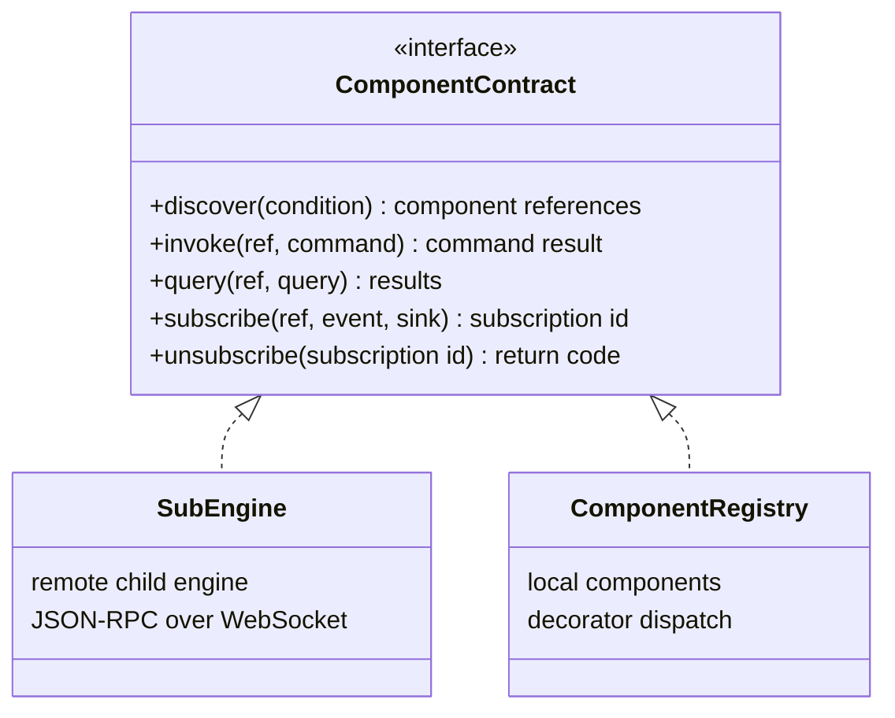

# The Component Contract

The engine does not know how a component is implemented or where it runs. It depends on a
single internal contract of five methods. The contract is distinct from the five external
RoIS interfaces: those are what applications see, and this is what the engine calls.

## The Five Methods

| Method | Purpose | Serves |
|--------|---------|--------|
| `discover` | Find components matching a condition | `search`, profile aggregation |
| `invoke` | Run a command or a long-running operation | `execute`, `set_parameter`, `start`, `stop`, `suspend`, `resume` |
| `query` | Read state synchronously | `query`, `component_status` |
| `subscribe` | Register a sink for asynchronous events | `subscribe` |
| `unsubscribe` | Cancel an event subscription | `unsubscribe` |

## Two Implementations, One Abstraction

- **`SubEngine`** is the remote implementation. It forwards each call as JSON-RPC 2.0 over
  WebSocket to a child engine and routes the child's event notifications back to the
  right sink.
- **`ComponentRegistry`** is the local implementation. It dispatches each call to the
  handler method that a component declared with a decorator.

The engine uses both through the same abstraction, which is what makes the
[recursive engine](recursive-engine.md) possible.

## Why Five Methods and No More

Quality of service, deadlines, reliability, and discovery mechanisms differ completely
between DDS, gRPC, and a game engine. Adding knobs for any of them to the contract would
leak one paradigm into the engine. Keeping the contract minimal lets the same
control-plane code drive a gRPC robot, a ROS 2 fleet, a virtual avatar, or a set of AI
services. Backend-specific concerns stay inside the adapter that needs them.

## Conformance

The contract is what a conformance suite can check. `openrois_components_core.conformance`
drives an engine through the RoIS operations and reports every component whose profile,
queries, lifecycle commands, parameters, or events break a rule. See
[check conformance](../guides/components-and-adapters.md#check-conformance).

## Partial Implementations

A component may implement only part of the normative interface for its type. A robot
that cannot pause navigation implements `start` and `stop` but not `suspend` and
`resume`. The component profile declares exactly which operations are supported, and
applications build their interface from the profile rather than assuming the full
canonical set.
