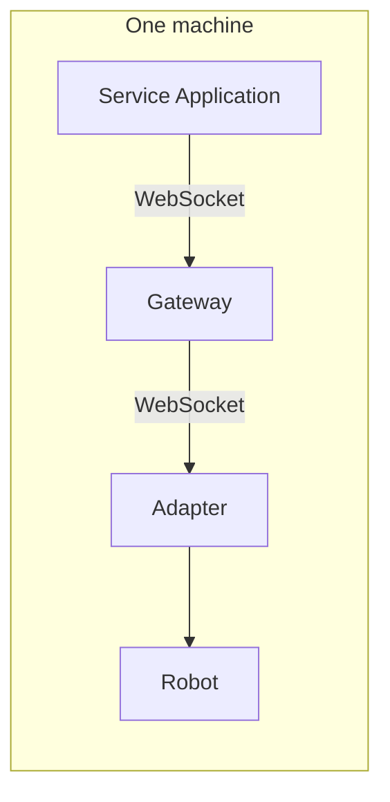
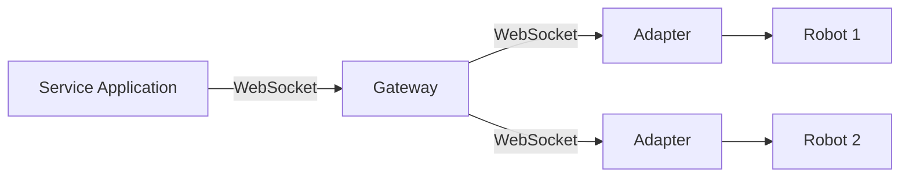
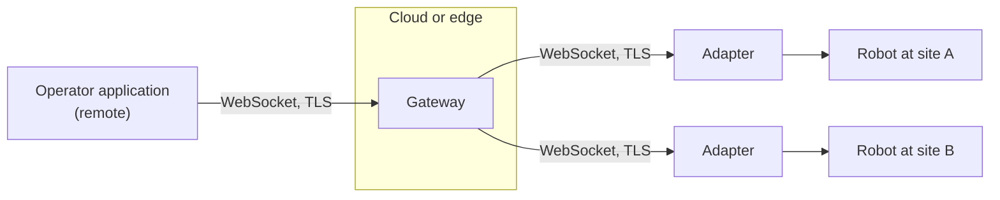
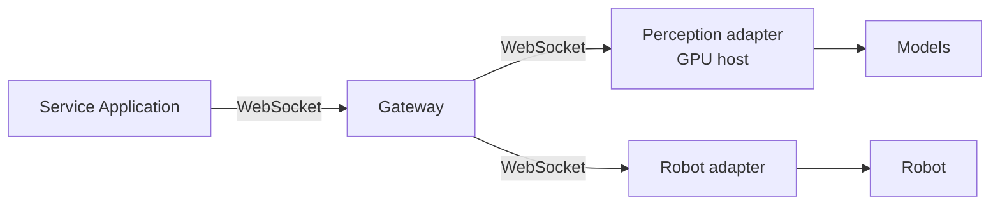

# Deployment Topologies

The control plane is uniform, so deployments of very different scales differ mainly in
**where the processes run**. The application, the gateway, and the adapters are the same
software in every case.

## Single Host

Everything runs on one machine: the application, the gateway, and the adapter. This is the
development setup, and it also suits a robot whose onboard computer runs the whole stack.

## Local Network

A gateway on the network serves several robots, each with its own adapter, and presents
one aggregated profile to the application.

## Across the Internet

The operator application, the gateway, and each robot may be in three different places, as
in teleoperation. WebSocket connections are outbound from the adapters, so robots behind a
firewall can join a gateway in the cloud.

## Cloud Perception

Components that need more compute than a robot carries, such as speech recognition or
large perception models, run in a separate adapter next to the compute, or as local
components of the gateway. The application cannot tell the difference: `search` returns
every component, and `bind` and `execute` behave identically wherever the component runs.

## Physical Robots and Virtual Agents Together

The same architecture serves virtual agents. An avatar rendered in a game engine gets its
own adapter, and the application addresses it with the same calls it uses for a physical
robot.

[`examples/mixed-paradigm`](https://github.com/openrois/openrois/tree/dev/examples/mixed-paradigm)
shows it: one script starts a gateway, connects the mock robot adapter and the
[avatar adapter](https://github.com/openrois/openrois/tree/dev/examples/avatar-adapter)
(a text-based virtual agent with `SpeechSynthesis` and `Reaction`), then plays an
application that discovers both, queries both positions, and makes both say the same
sentence with identical `set_parameter` and `execute` calls, waiting for both
`rois.command.completed`. The application's code addresses components by ref only. Both
sides are simulated so the demonstration runs on any laptop; the same script runs against
real adapters.
