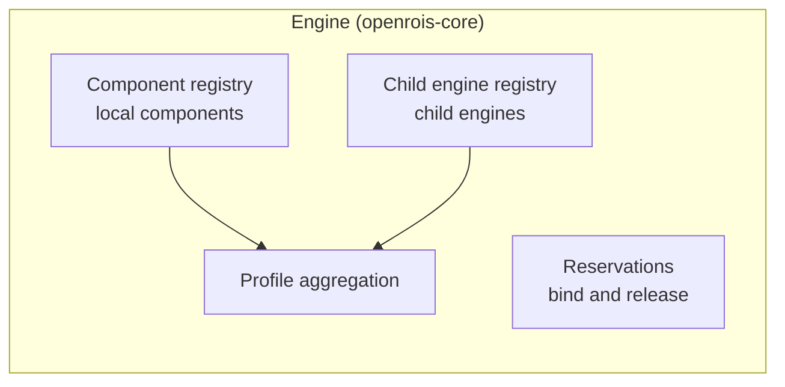

# The Recursive Engine

RoIS 2.0 distinguishes a **main HRI Engine**, the single entry point for applications, from
**sub HRI Engines**, which manage the components of individual units. OpenRoIS realizes
both roles with one class, `Engine`, from the `openrois-core` package.

## One Class, Two Registries

An `Engine` holds two registries, and either can be populated:

| Registry | Holds | Typically populated in |
|----------|-------|------------------------|
| Component registry | Local components, dispatched in process | Adapters (sub HRI Engines) |
| Child engine registry | Proxies for child engines, reached over WebSocket | The gateway (main HRI Engine) |

It also tracks reservations made with `bind` and `release`, and aggregates the profiles of
local components and child engines into a single HRI Engine profile.



When a call arrives, the engine resolves the component reference. A local component is
dispatched directly. A reference such as `robot_1/Navigation` is forwarded to the child
engine `robot_1`.

## Processes Are Compositions

The gateway and an adapter are not two different kinds of engine. They are two
compositions of the same class:

| Process | Composition |
|---------|-------------|
| Gateway | `Engine` + `WsServer`, accepting clients and adapters on one port |
| Adapter | `Engine` + local components + `WsClient`, connecting to the gateway |

```python title="gateway.py"
from openrois_core import Engine, WsServer

server = WsServer(Engine(enforce_bindings=True))
await server.start("0.0.0.0", 8765)
```

```python title="adapter.py"
from openrois_core import Engine, WsClient

engine = Engine(engine_id="robot_1", platform="my_robot")
engine.register_component("Navigation", navigation, navigation_meta)
WsClient(engine, "ws://gateway.example.org:8765").run()
```

The gateway enforces reservations (`enforce_bindings=True`): only the application that
bound an actuation component may command it. Adapters trust the gateway and skip the
redundant check, consistent with RoIS, which consolidates resource ownership in the HRI
Engine.

## Why It Matters

Without this model, the dispatch logic that turns RoIS calls into component calls would
exist twice: once in the gateway and once in every adapter framework, possibly in
different languages. A recursive engine gives one implementation, one set of tests, and
one behavior. It also matches the specification literally, since a sub HRI Engine is an
engine, not a passive backend.

Nothing in the design limits the depth of the hierarchy: a child engine can itself have
child engines. Current deployments use one gateway and one level of adapters.

## Discovery and Registration

When an adapter connects to the gateway on the `/adapter` path, the gateway asks it for
its components, registers it as a child engine, and broadcasts
`rois.system.profile_changed` to connected applications. When the adapter disconnects,
its components and any reservations on them are removed, and applications are notified
again.
