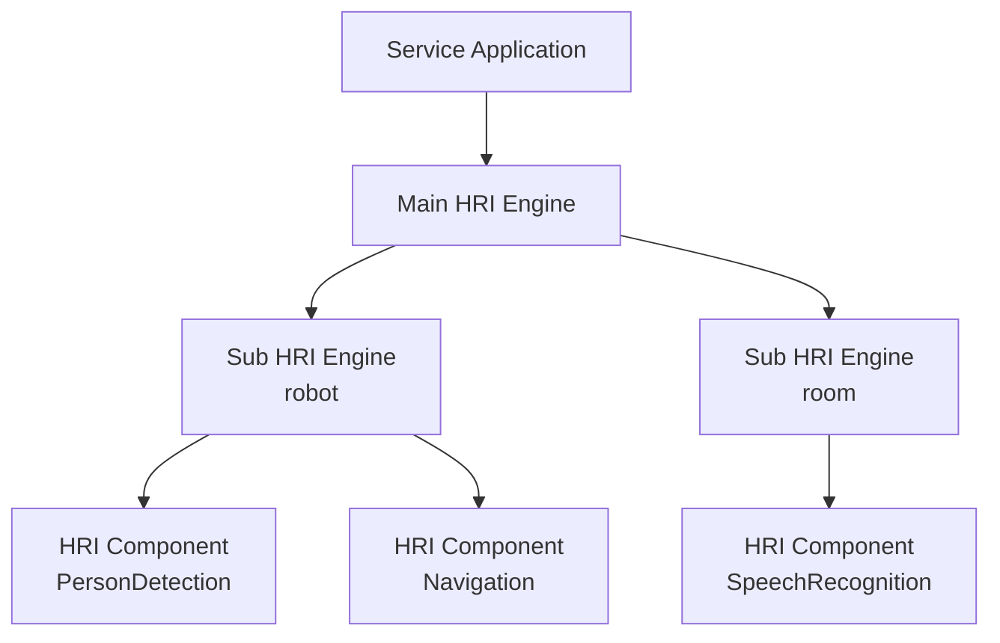

# RoIS in a Nutshell

The **Robotic Interaction Service (RoIS) Framework** is a specification of the Object
Management Group (OMG). Version 2.0 was published in June 2026 as OMG document
[formal/26-06-03](https://www.omg.org/spec/RoIS/2.0). This page summarizes the parts
of the specification that shape OpenRoIS. The specification itself remains the
authoritative source.

## A Platform-Independent Model

RoIS defines a **platform-independent model** of the messages exchanged between service
applications and human-robot interaction (HRI) functions. Its central idea is that an
application interacts with a robot at the **symbolic level** ("a person was detected",
"approach the person", "say this message") rather than at the physical level of camera
frames and motor commands. Symbolic results can be used directly in the conditional
logic of a robot scenario.

## Engines and Components

| Concept | Role |
|---------|------|
| **HRI Component** | An abstract function, such as person detection, speech synthesis, or navigation, whose internal structure is hidden. |
| **Sub HRI Engine** | Manages the components of one physical or virtual unit, for example one robot or one room. |
| **Main HRI Engine** | Represents the whole system. It is the only entry point for applications. |
| **Service Application** | Software that uses components, through the main HRI Engine, to implement a scenario. |

Applications never address sub HRI Engines directly. Selecting and switching between
sub HRI Engines and components happens inside the engine, invisible to the application.

## The Five Interfaces

| Interface | Style | Key operations |
|-----------|-------|----------------|
| **System** | Connection management | `connect`, `disconnect`, `get_profile`, `get_error_detail` |
| **Command** | Asynchronous execution | `search`, `bind`, `bind_any`, `release`, `get_parameter`, `set_parameter`, `execute`, `get_command_result` |
| **Query** | Synchronous reads | `query` |
| **Event** | Asynchronous notifications | `subscribe`, `unsubscribe`, `get_event_detail`, `notify_event` |
| **Streaming** | Stream control for audio and video | `connect_stream`, `disconnect_stream`, `suspend_stream`, `resume_stream`, `query_stream_status` |

## The Command Lifecycle

A component may be shared by several applications, so commands follow a reservation
pattern:

1. **Bind.** `search` returns candidate component references, and `bind` reserves one.
   `set_parameter` configures it.
2. **Execute.** `execute` returns a command identifier immediately. The command runs
   asynchronously, and `completed` reports its end.
3. **Release.** `release` frees the component for other applications.

A single `execute` call can carry a `CommandUnitSequence` that combines sequential steps
with groups of concurrent commands.

## Profiles

Applications learn what an engine offers from **profiles**: an HRI Engine profile lists
components, each HRI Component profile lists its command, query, and event messages,
and message profiles describe their parameters and results. Profiles are defined in XML,
validated by the normative `XML-Profiles.xsd` schema.

## Basic HRI Components

RoIS 2.0 defines 17 basic HRI Components. All of them except System Information share
the common commands `start`, `stop`, `suspend`, and `resume`, and the common query
`component_status`.

| Group | Components |
|-------|------------|
| Perception | Person Detection, Person Localization, Person Identification, Face Detection, Face Localization, Sound Detection, Sound Localization |
| Recognition | Speech Recognition, Gesture Recognition |
| Actuation | Speech Synthesis, Reaction, Navigation, Follow, Move |
| Streaming | Audio Streaming, Video Streaming |
| System | System Information |

Applications may also define their own components, reusing the common messages and the
profile mechanism.

## What RoIS Leaves Open

RoIS defines messages, not transport. Its platform-specific models cover C++, CORBA, and
XML profiles, and implementations may carry the messages over CORBA, OMG RTC, ROS 2 and
DDS, WebSocket, or any other transport. RoIS standardizes stream **control** but not
media encoding or transport. These open choices are exactly where OpenRoIS makes
[explicit implementation decisions](design-principles.md).
