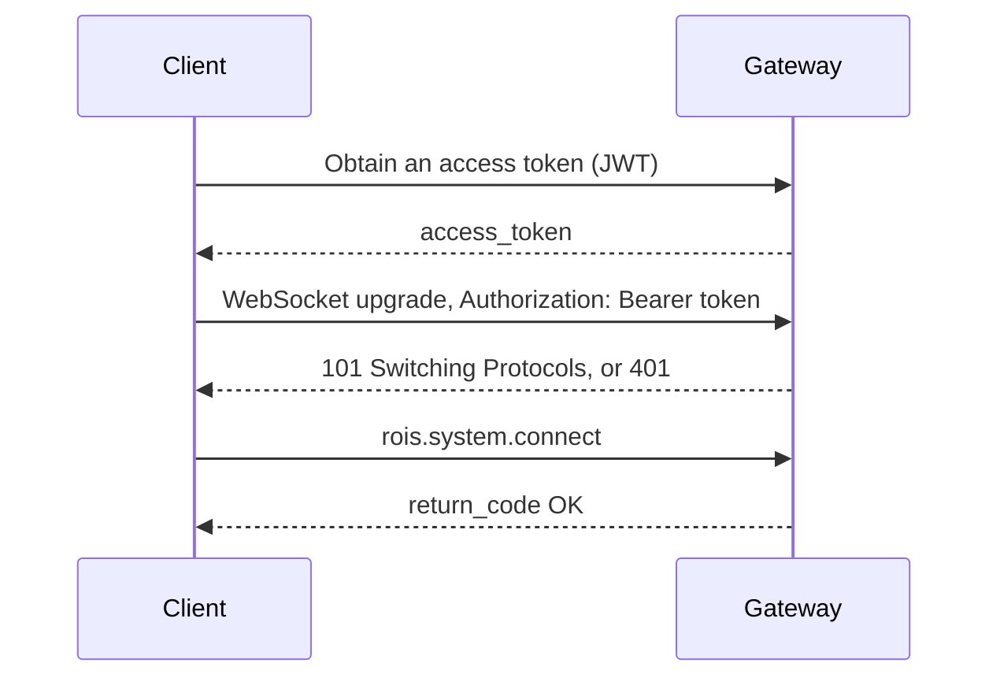

# Security

:::caution Status
Authentication, authorization, and TLS are **available and off by default** in the alpha:
a gateway started without `--auth-key` trusts every connection. Turn them on before
exposing a gateway beyond a trusted network. Token issuance (an identity provider) is
outside OpenRoIS; DDS Security and media encryption remain planned. See the
[roadmap](../project/roadmap.md).
:::

The RoIS `connect` operation takes no credentials, because the specification assumes a
trusted network. OpenRoIS targets remote operation over the internet, so it adds security
around the RoIS interfaces without changing them. The gateway is the only process exposed
to the network, which makes it the single enforcement point.

## Authentication

Clients authenticate **before** any RoIS message is processed, at the WebSocket upgrade,
with a JSON Web Token (JWT). A connection without a valid token is refused with HTTP 401,
and a token without the right role for the path (`/adapter` needs the `adapter` role) with
HTTP 403. The token travels as an `Authorization: Bearer` header, or as the `token` query
parameter from a browser, which cannot set upgrade headers. The gateway verifies the
signature (HS256 with a shared secret, or RS256 and ES256 with a public key), the expiry,
and, when configured, the issuer and audience.

```bash
openrois-gateway --auth-key "$SECRET" --auth-issuer my-issuer --tls-cert cert.pem --tls-key key.pem
```

The same options can live in a configuration file (`openrois-gateway --config gateway.yaml`),
which keeps secrets and key paths out of the process list:

```yaml
auth:
  key: /run/secrets/jwt-public.pem
  algorithm: RS256
  issuer: my-issuer
tls:
  cert: /etc/openrois/cert.pem
  key: /etc/openrois/key.pem
```

```ts
const client = await RoISClient.connect("wss://gateway.example.org", { token });
```

Who issues tokens is up to the deployment: any identity provider that signs JWTs with the
`roles` and `scope` claims below works. OpenRoIS does not ship one.



## Authorization

Authorization uses role-based access control (RBAC), enforced per RoIS operation from the
`roles` claim, and a `scope` claim of component ref patterns (`["robot_1/*"]`) that limits
what the token may see and address. A call outside the token's rights answers with the
`ERROR` return code and a `rois.system.notify_error`; `search` and `get_profile` only list
components inside the scope.

| Role | May call |
|------|----------|
| `administrator` | Every operation |
| `operator` | Everything a viewer may, plus `bind`, `bind_any`, `release`, `set_parameter`, `execute` |
| `viewer` | `connect`, `get_profile`, `search`, `query`, `subscribe`, the detail queries, stream control |
| `maintenance` | The viewer's operations without stream control; scope it to `*/SystemInformation` |
| `adapter` | Nothing on the client path; required to connect on `/adapter` |

## Defense in Depth

1. TLS on every connection that leaves a host (`--tls-cert`, `--tls-key`).
2. JWT authentication at the WebSocket upgrade.
3. RBAC authorization for each RoIS operation, with scopes.
4. DDS Security or separate DDS domains inside ROS 2 based adapters (planned).
5. DTLS and SRTP encryption for WebRTC media (planned, with the media data plane).

## Reporting a Vulnerability

Please report security issues privately by email to **info@coarobo.com** with the subject
"OpenRoIS security report", rather than in public issues. GitHub private vulnerability
reporting will be enabled together with authentication and session management (Phase 9),
since the alpha implements the message-passing framework only. See the
[security policy](https://github.com/openrois/openrois/blob/dev/SECURITY.md).
