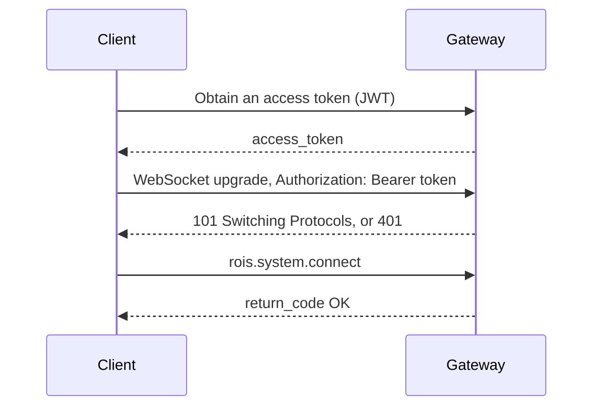

# Security

:::caution Status
The mechanisms on this page are **planned**. The current alpha releases do not
authenticate or authorize connections. Run the gateway only on trusted networks until
authentication is available. See the [roadmap](../project/roadmap.md).
:::

The RoIS `connect` operation takes no credentials, because the specification assumes a
trusted network. OpenRoIS targets remote operation over the internet, so it adds security
around the RoIS interfaces without changing them. The gateway is the only process exposed
to the network, which makes it the single enforcement point.

## Authentication

Clients authenticate **before** any RoIS message is processed, at the WebSocket upgrade,
with a JSON Web Token (JWT). A connection without a valid token is refused with HTTP 401.

## Authorization

Authorization uses role-based access control (RBAC), enforced per RoIS operation using the
claims in the token.

| Role | Robots | Components |
|------|--------|------------|
| Administrator | All | All |
| Operator | Assigned | Assigned, including actuation |
| Viewer | Assigned | Detection and streaming only |
| Maintenance | Assigned | System information |

| Operation | Enforcement |
|-----------|-------------|
| `search` | Results are filtered to authorized components, so others are invisible |
| `bind`, `execute` | References outside the caller's scope are rejected |
| `query`, `subscribe` | Results and events are limited to authorized sources |
| `connect_stream` | Requires the streaming scope |

## Defense in Depth

1. TLS on every connection that leaves a host.
2. JWT authentication at the WebSocket upgrade.
3. RBAC authorization for each RoIS operation.
4. DDS Security or separate DDS domains inside ROS 2 based adapters.
5. DTLS and SRTP encryption for WebRTC media.

## Reporting a Vulnerability

Please report security issues privately by email to **info@coarobo.com** with the subject
"OpenRoIS security report", rather than in public issues. GitHub private vulnerability
reporting will be enabled together with authentication and session management (Phase 9),
since the alpha implements the message-passing framework only. See the
[security policy](https://github.com/openrois/openrois/blob/dev/SECURITY.md).
