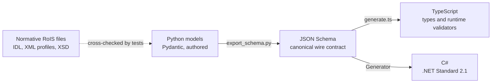

# The Type Pipeline

A middleware that spans three languages can easily end up with three slightly different
definitions of the same message. OpenRoIS avoids this with a single source of truth: RoIS
types are authored once and generated everywhere else.



## The Flow

1. **Author.** RoIS types are Pydantic models in `interfaces/python`, derived from the
   normative IDL and XML profiles of RoIS 2.0.
2. **Export.** `scripts/export_schema.py` writes one JSON Schema file per type to
   `interfaces/schema`. JSON Schema is the canonical wire contract.
3. **Generate.** A TypeScript generator emits types together with runtime validators, and
   a C# generator emits sealed classes and enums for .NET Standard 2.1, which Unity
   supports.

Generated files are never edited by hand. Changing a type means changing the Python model
and running the pipeline.

## Guards Against Drift

| Test | What it guarantees |
|------|--------------------|
| Schema drift | The committed JSON Schema matches what the Python models produce |
| XML cross-check | Model fields, data types, and defaults agree with the normative XML component profiles |
| XSD consistency | Profile models agree with the normative `XML-Profiles.xsd` schema |
| Round trips | TypeScript and C# types serialize and deserialize the committed schemas |

The XML cross-check and XSD consistency tests read the normative OMG files, which are not
redistributed in the repository. They run only where those files are present, so a plain
clone cannot execute them.

## Typed Messages per Component

The generic RoIS `Result` carries every value as a string. OpenRoIS keeps it as the wire
format and additionally defines typed models per component, so a
`person_detected` event is available as a structured message:

```python
class PersonDetectedEvent(BaseModel):
    timestamp: DateTime = Field(description="Time when measured")
    number: Integer = Field(description="Number of detected persons")
```

Typed models exist today for PersonDetection, Navigation, Reaction, and System
Information. The remaining basic components follow on the [roadmap](../project/roadmap.md).
