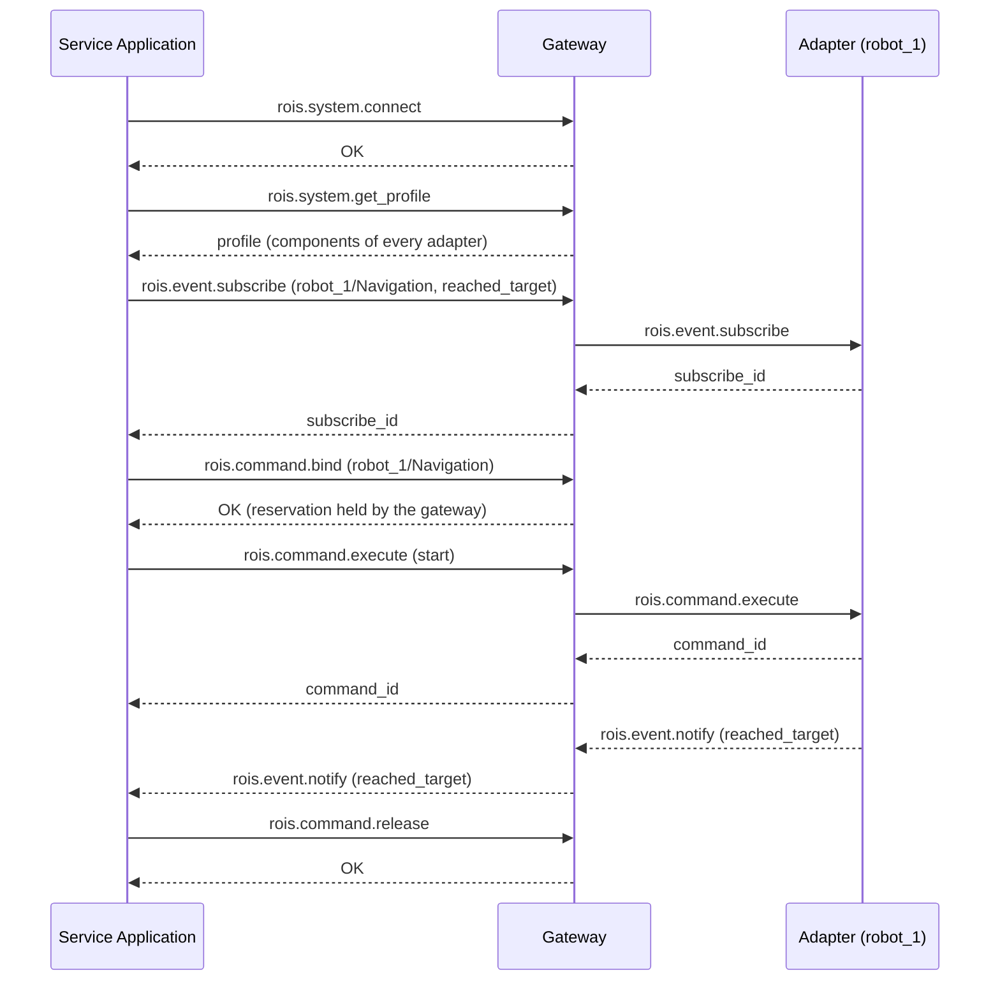

# Wire Protocol

OpenRoIS carries the five RoIS interfaces as [JSON-RPC 2.0](https://www.jsonrpc.org/specification)
messages over WebSocket. RoIS 2.0 leaves transport open, and this mapping is the concrete
choice OpenRoIS makes. It is what lets browsers, Unity, and any language with a WebSocket
client act as a RoIS service application.

## Messages

| Kind | Direction | Shape |
|------|-----------|-------|
| Request | Application to gateway | `{"jsonrpc": "2.0", "id": 1, "method": "rois.query.query", "params": {...}}` |
| Response | Gateway to application | `{"jsonrpc": "2.0", "id": 1, "result": {"return_code": "OK", ...}}` |
| Notification | Gateway to application | `{"jsonrpc": "2.0", "method": "rois.event.notify", "params": {...}}` |

Every result carries a RoIS `return_code`: `OK`, `ERROR`, `BAD_PARAMETER`, `UNSUPPORTED`,
`OUT_OF_RESOURCES`, or `TIMEOUT`. A RoIS-level failure is a normal response with a return
code other than `OK`. A JSON-RPC error object signals an internal error of the gateway.

Applications connect to the gateway on any path, for example `ws://host:8765/`. Adapters
connect on `/adapter`.

## Method Catalog

The status column shows what the current engine implements. Methods marked
<span className="status-pill status-pill--planned">Planned</span> are part of the
specification and on the [roadmap](../project/roadmap.md).

### System Interface

| Method | Params | Result | Status |
|--------|--------|--------|--------|
| `rois.system.connect` | none | `return_code` | <span className="status-pill status-pill--available">Available</span> |
| `rois.system.disconnect` | none | `return_code` | <span className="status-pill status-pill--available">Available</span> |
| `rois.system.get_profile` | `condition` | `return_code`, `profile` | <span className="status-pill status-pill--available">Available</span> |
| `rois.system.get_error_detail` | `error_id` | `return_code`, `results` | <span className="status-pill status-pill--planned">Planned</span> |

### Command Interface

| Method | Params | Result | Status |
|--------|--------|--------|--------|
| `rois.command.search` | `condition` | `return_code`, `component_ref_list` | <span className="status-pill status-pill--available">Available</span> |
| `rois.command.bind` | `component_ref` | `return_code` | <span className="status-pill status-pill--available">Available</span> |
| `rois.command.bind_any` | `condition` | `return_code`, `component_ref` | <span className="status-pill status-pill--planned">Planned</span> |
| `rois.command.release` | `component_ref` | `return_code` | <span className="status-pill status-pill--available">Available</span> |
| `rois.command.set_parameter` | `component_ref`, `parameters` | `return_code` | <span className="status-pill status-pill--available">Available</span> |
| `rois.command.get_parameter` | `component_ref`, `names` (optional, all when omitted) | `return_code`, `results` | <span className="status-pill status-pill--planned">Planned</span> |
| `rois.command.execute` | `component_ref`, `command_unit_list` | `return_code`, `command_id` | <span className="status-pill status-pill--available">Available</span> |
| `rois.command.get_command_result` | `command_id` | `return_code`, `results` | <span className="status-pill status-pill--planned">Planned</span> |

### Query Interface

| Method | Params | Result | Status |
|--------|--------|--------|--------|
| `rois.query.query` | `component_ref`, `query_type`, `condition` | `return_code`, `results` | <span className="status-pill status-pill--available">Available</span> |

### Event Interface

| Method | Params | Result | Status |
|--------|--------|--------|--------|
| `rois.event.subscribe` | `component_ref`, `event_type`, `condition` | `return_code`, `subscribe_id` | <span className="status-pill status-pill--available">Available</span> |
| `rois.event.unsubscribe` | `subscribe_id` | `return_code` | <span className="status-pill status-pill--available">Available</span> |
| `rois.event.get_event_detail` | `event_id` | `return_code`, `results` | <span className="status-pill status-pill--planned">Planned</span> |

### Streaming Interface

| Method | Params | Result | Status |
|--------|--------|--------|--------|
| `rois.stream.connect_stream` | `component_ref`, `parameters` | `return_code`, `stream_id` | <span className="status-pill status-pill--planned">Planned</span> |
| `rois.stream.disconnect_stream` | `stream_id` | `return_code` | <span className="status-pill status-pill--planned">Planned</span> |
| `rois.stream.suspend_stream` | `stream_id` | `return_code` | <span className="status-pill status-pill--planned">Planned</span> |
| `rois.stream.resume_stream` | `stream_id` | `return_code` | <span className="status-pill status-pill--planned">Planned</span> |
| `rois.stream.query_stream_status` | `stream_id` | `return_code`, `status` | <span className="status-pill status-pill--planned">Planned</span> |

### Notifications

| Method | Carries | Status |
|--------|---------|--------|
| `rois.event.notify` | `event_id`, `subscribe_id`, `component_ref`, `event_type`, `expire`, `results` | <span className="status-pill status-pill--available">Available</span> |
| `rois.system.profile_changed` | none (OpenRoIS extension: refresh the profile) | <span className="status-pill status-pill--available">Available</span> |
| `rois.command.completed` | `command_id`, `status` | <span className="status-pill status-pill--planned">Planned</span> |
| `rois.system.notify_error` | `error_id`, `error_type` | <span className="status-pill status-pill--planned">Planned</span> |
| `rois.stream.notify_status` | `stream_id`, `status` | <span className="status-pill status-pill--planned">Planned</span> |

## Data Types

**Result** and **Parameter** share one shape. Values are always strings, as in the RoIS
IDL, and typed models per component give them structure in the SDKs.

```json
{ "name": "target_positions", "data_type_ref": "string[]", "value": "[\"kitchen\"]" }
```

**Component status** values: `UNINITIALIZED` (0), `READY` (1), `BUSY` (2), `WARNING` (3),
`ERROR` (4). The `component_status` query returns the numeric form.

**Completed status** values: `OK`, `ERROR`, `ABORT`, `OUT_OF_RESOURCES`, `TIMEOUT`.

## A Complete Session



### Discover Components

```json title="Request"
{ "jsonrpc": "2.0", "id": 1, "method": "rois.system.get_profile", "params": {} }
```

```json title="Response"
{
  "jsonrpc": "2.0",
  "id": 1,
  "result": {
    "return_code": "OK",
    "profile": {
      "identifier": { "authority": "OpenRoIS", "code": "Engine", "codebook_ref": "", "version": "" },
      "sub_engine_ids": ["robot_1"],
      "component_ids": ["robot_1/Navigation"],
      "component_profiles": [
        {
          "identifier": { "authority": "OpenRoIS", "code": "Navigation", "codebook_ref": "", "version": "" },
          "name": "Navigation",
          "function": "actuation",
          "command_profiles": [{ "name": "start" }, { "name": "stop" }, { "name": "set_parameter" }],
          "query_profiles": [{ "name": "component_status" }],
          "event_profiles": [{ "name": "reached_target" }],
          "parameter_profiles": [{ "name": "target_positions", "data_type_ref": "string[]" }]
        }
      ]
    }
  }
}
```

### Subscribe to an Event

```json title="Request"
{
  "jsonrpc": "2.0", "id": 2, "method": "rois.event.subscribe",
  "params": { "component_ref": "robot_1/Navigation", "event_type": "reached_target", "condition": "" }
}
```

```json title="Response"
{ "jsonrpc": "2.0", "id": 2, "result": { "return_code": "OK", "subscribe_id": "sub-3f2a91c0" } }
```

### Reserve and Command a Component

```json title="Request"
{ "jsonrpc": "2.0", "id": 3, "method": "rois.command.bind", "params": { "component_ref": "robot_1/Navigation" } }
```

```json title="Response"
{ "jsonrpc": "2.0", "id": 3, "result": { "return_code": "OK" } }
```

If another application already holds the reservation, the result is
`{"return_code": "OUT_OF_RESOURCES"}`.

```json title="Request"
{
  "jsonrpc": "2.0", "id": 4, "method": "rois.command.execute",
  "params": {
    "component_ref": "robot_1/Navigation",
    "command_unit_list": [
      {
        "component_ref": "robot_1/Navigation",
        "command_type": "start",
        "arguments": [{ "name": "target_positions", "data_type_ref": "string[]", "value": "[\"kitchen\"]" }]
      }
    ]
  }
}
```

```json title="Response"
{ "jsonrpc": "2.0", "id": 4, "result": { "return_code": "OK", "command_id": "nav-1" } }
```

:::note Implementation note
RoIS allows a `CommandUnitSequence` to combine sequential commands with concurrent groups.
The current engine executes the first command unit. It also accepts the shorthand
`{"component_ref": ..., "command_type": "start", "parameters": [...]}`, which the
TypeScript SDK uses. Full sequences are on the [roadmap](../project/roadmap.md).
:::

### Receive an Event

```json title="Notification"
{
  "jsonrpc": "2.0",
  "method": "rois.event.notify",
  "params": {
    "event_id": "8b0c6d1e-5f4a-4b2e-9d3c-1a2b3c4d5e6f",
    "subscribe_id": "sub-3f2a91c0",
    "component_ref": "Navigation",
    "event_type": "reached_target",
    "expire": "",
    "results": [
      { "name": "target", "data_type_ref": "string", "value": "kitchen" },
      { "name": "is_final_target", "data_type_ref": "bool", "value": "true" }
    ]
  }
}
```

## Gateway to Adapter

The gateway speaks the same JSON-RPC methods to adapters, over the connection that each
adapter opens on `/adapter`. When an adapter connects, the gateway sends
`rois.system.get_profile` to learn its engine identifier and components, then forwards
queries, commands, and subscriptions to it. Adapters push `rois.event.notify`
notifications, which the gateway delivers to the subscribed applications.
